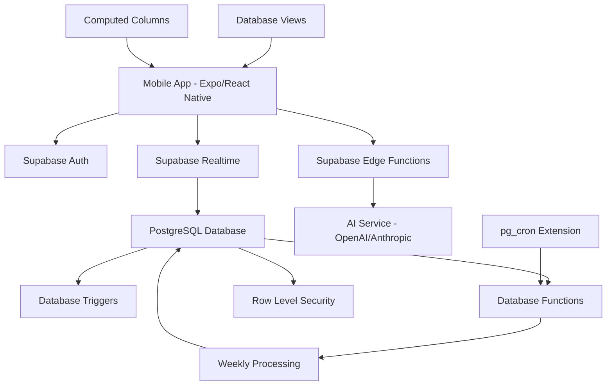

# Design Document

## Overview

The AI Habit Tracker is a React Native mobile application built with Expo that leverages Supabase's PostgreSQL-native architecture for backend services and AI for intelligent roadmap generation. The system follows a progressive habit-building methodology where users create long-term goals (Journeys) that are broken down into weekly stages with daily binary tasks. The architecture emphasizes database-driven logic, real-time synchronization via Supabase Realtime, and intelligent progression through PostgreSQL triggers and functions.

## Architecture

### High-Level Architecture



### Technology Stack

- **Frontend**: React Native with Expo SDK
- **Backend**: Supabase (Auth, PostgreSQL, Realtime, Edge Functions)
- **Database**: PostgreSQL with extensions (pg_cron, uuid-ossp)
- **AI Integration**: Supabase Edge Functions with OpenAI/Anthropic API
- **Real-time**: Supabase Realtime WebSocket subscriptions
- **Security**: Row Level Security (RLS) policies
- **Scheduling**: pg_cron extension + PostgreSQL functions
- **State Management**: React Context + Supabase Realtime subscriptions
- **Navigation**: React Navigation v6
- **UI Components**: React Native Elements

### Data Flow

1. User creates journey through AI chat interface
2. Edge Function calls AI service and stores roadmap in PostgreSQL
3. Database triggers automatically create initial week and stage records
4. Daily check-ins trigger PostgreSQL functions for real-time aggregation
5. pg_cron runs weekly processing functions for stage advancement
6. Database changes stream to mobile app via Supabase Realtime
7. Row Level Security ensures user data isolation at database level

## Components and Interfaces

### Mobile App Components

#### Screen Components

**CreateJourneyScreen**
- Chat interface for goal input and AI interaction
- Roadmap preview with accept/modify options
- Integration with AI roadmap generation API
- Form validation and error handling

**DailyScreen**
- Current day's tasks with Yes/No/Skip buttons
- Progress indicators and celebratory animations
- Offline support with sync when connected
- Task completion history for current week

**WeeklyScreen**
- Weekly progress visualization (progress bars, charts)
- Success/failure status for current and past weeks
- Stage advancement notifications
- Performance trends and insights

**RoadmapScreen**
- Interactive roadmap visualization
- Current stage highlighting
- Future stage previews
- Historical performance overlay

#### Core Components

**TaskButton**
```typescript
interface TaskButtonProps {
  taskId: string;
  value: 'yes' | 'no' | 'skip' | null;
  onPress: (value: 'yes' | 'no' | 'skip') => void;
  disabled?: boolean;
}
```

**ProgressIndicator**
```typescript
interface ProgressIndicatorProps {
  current: number;
  target: number;
  showAnimation?: boolean;
  variant: 'daily' | 'weekly';
}
```

**RoadmapNode**
```typescript
interface RoadmapNodeProps {
  stage: Stage;
  status: 'completed' | 'current' | 'upcoming';
  weeklyResults?: WeekResult[];
}
```

### Backend Services

#### Supabase Edge Functions

**AI Roadmap Generation**
```typescript
// /functions/v1/generate-roadmap
import { serve } from "https://deno.land/std@0.168.0/http/server.ts"
import { createClient } from 'https://esm.sh/@supabase/supabase-js@2'

interface RoadmapRequest {
  objective: string;
  userPreferences?: {
    maxWeeklyTarget?: number;
    minRestDays?: number;
    preferredDifficulty?: 'easy' | 'medium' | 'hard';
  };
}

interface RoadmapResponse {
  objective: {
    title: string;
    description: string;
    taskName: string;
    guardrails: Guardrails;
    copy: RoadmapCopy;
  };
  stages: Stage[];
}

serve(async (req) => {
  const { objective, userPreferences } = await req.json()
  
  // Call AI service
  const roadmap = await generateRoadmapWithAI(objective, userPreferences)
  
  // Store in database with transaction
  const supabase = createClient(...)
  const { data, error } = await supabase.rpc('create_objective_with_stages', {
    objective_data: roadmap.objective,
    stages_data: roadmap.stages
  })
  
  return new Response(JSON.stringify(data), {
    headers: { 'Content-Type': 'application/json' }
  })
})
```

**Manual Stage Advancement**
```typescript
// /functions/v1/advance-stage
serve(async (req) => {
  const { objectiveId } = await req.json()
  
  const supabase = createClient(...)
  const { data, error } = await supabase.rpc('advance_stage_manually', {
    objective_id: objectiveId
  })
  
  return new Response(JSON.stringify({ success: !error, data }))
})
```

#### Database RPC Functions

```sql
-- Create objective with stages in a transaction
CREATE OR REPLACE FUNCTION create_objective_with_stages(
  objective_data JSONB,
  stages_data JSONB[]
) RETURNS UUID AS $$
DECLARE
  new_objective_id UUID;
  stage_data JSONB;
BEGIN
  -- Insert objective
  INSERT INTO objectives (
    user_id, title, description, task_name, guardrails, copy
  ) VALUES (
    auth.uid(),
    objective_data->>'title',
    objective_data->>'description', 
    objective_data->>'taskName',
    objective_data->'guardrails',
    objective_data->'copy'
  ) RETURNING id INTO new_objective_id;
  
  -- Insert stages
  FOREACH stage_data IN ARRAY stages_data LOOP
    INSERT INTO stages (
      objective_id, stage_number, weekly_target, 
      promotion_k_consecutive, description, tips
    ) VALUES (
      new_objective_id,
      (stage_data->>'stageNumber')::INTEGER,
      (stage_data->>'weeklyTarget')::INTEGER,
      (stage_data->>'promotionKConsecutive')::INTEGER,
      stage_data->>'description',
      ARRAY(SELECT jsonb_array_elements_text(stage_data->'tips'))
    );
  END LOOP;
  
  -- Create initial week result
  INSERT INTO week_results (objective_id, stage_number, week_start, week_end, weekly_target)
  SELECT 
    new_objective_id,
    1,
    wb.week_start,
    wb.week_end,
    s.weekly_target
  FROM get_week_boundaries() wb
  CROSS JOIN stages s
  WHERE s.objective_id = new_objective_id AND s.stage_number = 1;
  
  RETURN new_objective_id;
END;
$$ LANGUAGE plpgsql SECURITY DEFINER;

-- Manual stage advancement with validation
CREATE OR REPLACE FUNCTION advance_stage_manually(objective_id UUID)
RETURNS JSONB AS $$
DECLARE
  current_obj RECORD;
  next_stage RECORD;
  result JSONB;
BEGIN
  -- Get current objective state
  SELECT * INTO current_obj FROM objectives WHERE id = objective_id AND user_id = auth.uid();
  
  IF NOT FOUND THEN
    RETURN jsonb_build_object('error', 'Objective not found');
  END IF;
  
  -- Check if next stage exists
  SELECT * INTO next_stage FROM stages 
  WHERE objective_id = objective_id AND stage_number = current_obj.current_stage_number + 1;
  
  IF NOT FOUND THEN
    RETURN jsonb_build_object('error', 'No next stage available');
  END IF;
  
  -- Advance stage
  UPDATE objectives 
  SET current_stage_number = current_obj.current_stage_number + 1,
      consecutive_successes = 0,
      updated_at = NOW()
  WHERE id = objective_id;
  
  RETURN jsonb_build_object(
    'success', true, 
    'newStage', current_obj.current_stage_number + 1
  );
END;
$$ LANGUAGE plpgsql SECURITY DEFINER;
```

#### Supabase Client API Usage

```typescript
// Mobile app uses Supabase client directly
const supabase = createClient(url, key)

// Real-time subscriptions
const subscription = supabase
  .channel('user-progress')
  .on('postgres_changes', {
    event: '*',
    schema: 'public',
    table: 'checkins',
    filter: `objective_id=eq.${objectiveId}`
  }, (payload) => {
    // Update UI in real-time
    updateProgressUI(payload)
  })
  .subscribe()

// Direct database operations
const { data: objectives } = await supabase
  .from('objectives')
  .select(`
    *,
    stages(*),
    current_week_progress(*)
  `)
  .eq('active', true)
```

## Data Models

### Supabase PostgreSQL Schema

```sql
-- Enable required extensions
CREATE EXTENSION IF NOT EXISTS "uuid-ossp";
CREATE EXTENSION IF NOT EXISTS "pg_cron";

-- Profiles table (extends Supabase auth.users)
CREATE TABLE profiles (
  id UUID REFERENCES auth.users(id) PRIMARY KEY,
  display_name TEXT,
  timezone TEXT DEFAULT 'UTC',
  notifications BOOLEAN DEFAULT true,
  week_start_day TEXT DEFAULT 'monday' CHECK (week_start_day IN ('monday', 'sunday')),
  created_at TIMESTAMPTZ DEFAULT NOW(),
  updated_at TIMESTAMPTZ DEFAULT NOW()
);

-- Objectives table with computed fields
CREATE TABLE objectives (
  id UUID DEFAULT uuid_generate_v4() PRIMARY KEY,
  user_id UUID REFERENCES auth.users(id) ON DELETE CASCADE,
  title TEXT NOT NULL,
  description TEXT,
  task_name TEXT NOT NULL,
  active BOOLEAN DEFAULT true,
  current_stage_number INTEGER DEFAULT 1,
  consecutive_successes INTEGER DEFAULT 0,
  guardrails JSONB NOT NULL DEFAULT '{"maxWeeklyTarget": 7, "minRestDays": 1}',
  copy JSONB NOT NULL DEFAULT '{}',
  created_at TIMESTAMPTZ DEFAULT NOW(),
  updated_at TIMESTAMPTZ DEFAULT NOW()
);

-- Stages table with better normalization
CREATE TABLE stages (
  id UUID DEFAULT uuid_generate_v4() PRIMARY KEY,
  objective_id UUID REFERENCES objectives(id) ON DELETE CASCADE,
  stage_number INTEGER NOT NULL,
  weekly_target INTEGER NOT NULL CHECK (weekly_target > 0 AND weekly_target <= 7),
  promotion_k_consecutive INTEGER NOT NULL DEFAULT 2,
  description TEXT,
  tips TEXT[] DEFAULT '{}',
  created_at TIMESTAMPTZ DEFAULT NOW(),
  UNIQUE(objective_id, stage_number)
);

-- Week results with automatic calculation
CREATE TABLE week_results (
  id UUID DEFAULT uuid_generate_v4() PRIMARY KEY,
  objective_id UUID REFERENCES objectives(id) ON DELETE CASCADE,
  stage_number INTEGER NOT NULL,
  week_start DATE NOT NULL,
  week_end DATE NOT NULL,
  weekly_target INTEGER NOT NULL,
  completed_days INTEGER DEFAULT 0,
  total_checkins INTEGER DEFAULT 0,
  result TEXT CHECK (result IN ('pass', 'fail', 'in_progress')) DEFAULT 'in_progress',
  processed_at TIMESTAMPTZ,
  created_at TIMESTAMPTZ DEFAULT NOW(),
  UNIQUE(objective_id, week_start)
);

-- Checkins table with better constraints
CREATE TABLE checkins (
  id UUID DEFAULT uuid_generate_v4() PRIMARY KEY,
  objective_id UUID REFERENCES objectives(id) ON DELETE CASCADE,
  stage_number INTEGER NOT NULL,
  task_date DATE NOT NULL,
  value TEXT CHECK (value IN ('yes', 'no', 'skip')) NOT NULL,
  created_at TIMESTAMPTZ DEFAULT NOW(),
  UNIQUE(objective_id, task_date)
);

-- Indexes for performance
CREATE INDEX idx_objectives_user_active ON objectives(user_id, active);
CREATE INDEX idx_stages_objective ON stages(objective_id, stage_number);
CREATE INDEX idx_week_results_objective_date ON week_results(objective_id, week_start);
CREATE INDEX idx_checkins_objective_date ON checkins(objective_id, task_date);
CREATE INDEX idx_checkins_date_value ON checkins(task_date, value);

-- Views for common queries
CREATE VIEW current_week_progress AS
SELECT 
  o.id as objective_id,
  o.user_id,
  o.title,
  o.task_name,
  o.current_stage_number,
  s.weekly_target,
  wr.week_start,
  wr.week_end,
  wr.completed_days,
  wr.total_checkins,
  COALESCE(wr.result, 'in_progress') as result,
  (wr.completed_days >= s.weekly_target) as target_met
FROM objectives o
JOIN stages s ON s.objective_id = o.id AND s.stage_number = o.current_stage_number
LEFT JOIN week_results wr ON wr.objective_id = o.id 
  AND wr.week_start <= CURRENT_DATE 
  AND wr.week_end >= CURRENT_DATE
WHERE o.active = true;

CREATE VIEW user_progress_summary AS
SELECT 
  o.user_id,
  o.id as objective_id,
  o.title,
  o.current_stage_number,
  o.consecutive_successes,
  COUNT(wr.id) as total_weeks,
  COUNT(CASE WHEN wr.result = 'pass' THEN 1 END) as successful_weeks,
  COUNT(CASE WHEN wr.result = 'fail' THEN 1 END) as failed_weeks
FROM objectives o
LEFT JOIN week_results wr ON wr.objective_id = o.id AND wr.result IN ('pass', 'fail')
WHERE o.active = true
GROUP BY o.user_id, o.id, o.title, o.current_stage_number, o.consecutive_successes;

-- Database Functions for Business Logic

-- Function to get current week boundaries based on user timezone
CREATE OR REPLACE FUNCTION get_week_boundaries(user_timezone TEXT DEFAULT 'UTC', week_start_day TEXT DEFAULT 'monday')
RETURNS TABLE(week_start DATE, week_end DATE) AS $$
DECLARE
  current_date_tz DATE;
  days_to_subtract INTEGER;
BEGIN
  -- Get current date in user's timezone
  current_date_tz := (NOW() AT TIME ZONE user_timezone)::DATE;
  
  -- Calculate days to subtract to get to start of week
  IF week_start_day = 'monday' THEN
    days_to_subtract := EXTRACT(DOW FROM current_date_tz)::INTEGER - 1;
    IF days_to_subtract < 0 THEN days_to_subtract := 6; END IF;
  ELSE -- sunday
    days_to_subtract := EXTRACT(DOW FROM current_date_tz)::INTEGER;
  END IF;
  
  week_start := current_date_tz - days_to_subtract;
  week_end := week_start + 6;
  
  RETURN NEXT;
END;
$$ LANGUAGE plpgsql;

-- Function to update week results when checkins change
CREATE OR REPLACE FUNCTION update_week_results()
RETURNS TRIGGER AS $$
DECLARE
  week_bounds RECORD;
  user_profile RECORD;
  current_completed INTEGER;
  current_total INTEGER;
  target INTEGER;
BEGIN
  -- Get user profile for timezone
  SELECT timezone, week_start_day INTO user_profile
  FROM profiles p
  JOIN objectives o ON o.user_id = p.id
  WHERE o.id = COALESCE(NEW.objective_id, OLD.objective_id);
  
  -- Get week boundaries
  SELECT * INTO week_bounds 
  FROM get_week_boundaries(user_profile.timezone, user_profile.week_start_day);
  
  -- Get current stage target
  SELECT weekly_target INTO target
  FROM stages s
  JOIN objectives o ON o.id = s.objective_id
  WHERE s.objective_id = COALESCE(NEW.objective_id, OLD.objective_id)
    AND s.stage_number = o.current_stage_number;
  
  -- Calculate completed days and total checkins for current week
  SELECT 
    COUNT(CASE WHEN value = 'yes' THEN 1 END),
    COUNT(CASE WHEN value IN ('yes', 'no') THEN 1 END)
  INTO current_completed, current_total
  FROM checkins
  WHERE objective_id = COALESCE(NEW.objective_id, OLD.objective_id)
    AND task_date BETWEEN week_bounds.week_start AND week_bounds.week_end;
  
  -- Upsert week result
  INSERT INTO week_results (
    objective_id, stage_number, week_start, week_end, 
    weekly_target, completed_days, total_checkins, result
  )
  SELECT 
    COALESCE(NEW.objective_id, OLD.objective_id),
    o.current_stage_number,
    week_bounds.week_start,
    week_bounds.week_end,
    target,
    current_completed,
    current_total,
    CASE 
      WHEN week_bounds.week_end > CURRENT_DATE THEN 'in_progress'
      WHEN current_completed >= target THEN 'pass'
      ELSE 'fail'
    END
  FROM objectives o
  WHERE o.id = COALESCE(NEW.objective_id, OLD.objective_id)
  ON CONFLICT (objective_id, week_start) 
  DO UPDATE SET
    completed_days = EXCLUDED.completed_days,
    total_checkins = EXCLUDED.total_checkins,
    result = EXCLUDED.result,
    updated_at = NOW();
  
  RETURN COALESCE(NEW, OLD);
END;
$$ LANGUAGE plpgsql;

-- Function to process weekly results and handle stage advancement
CREATE OR REPLACE FUNCTION process_weekly_advancement()
RETURNS INTEGER AS $$
DECLARE
  processed_count INTEGER := 0;
  obj RECORD;
  consecutive_passes INTEGER;
  next_stage RECORD;
BEGIN
  -- Process all objectives with unprocessed completed weeks
  FOR obj IN 
    SELECT DISTINCT o.id, o.user_id, o.current_stage_number, o.consecutive_successes
    FROM objectives o
    JOIN week_results wr ON wr.objective_id = o.id
    WHERE o.active = true 
      AND wr.week_end < CURRENT_DATE 
      AND wr.processed_at IS NULL
      AND wr.result IN ('pass', 'fail')
  LOOP
    -- Count consecutive passes including current week
    SELECT COUNT(*) INTO consecutive_passes
    FROM (
      SELECT result,
             ROW_NUMBER() OVER (ORDER BY week_start DESC) as rn
      FROM week_results 
      WHERE objective_id = obj.id 
        AND result IN ('pass', 'fail')
        AND week_end < CURRENT_DATE
      ORDER BY week_start DESC
    ) recent_weeks
    WHERE result = 'pass' 
      AND rn <= (SELECT promotion_k_consecutive FROM stages WHERE objective_id = obj.id AND stage_number = obj.current_stage_number);
    
    -- Check if advancement is possible
    SELECT * INTO next_stage
    FROM stages 
    WHERE objective_id = obj.id 
      AND stage_number = obj.current_stage_number + 1;
    
    -- Update objective with new consecutive count and possibly advance stage
    IF next_stage.id IS NOT NULL AND consecutive_passes >= (
      SELECT promotion_k_consecutive FROM stages 
      WHERE objective_id = obj.id AND stage_number = obj.current_stage_number
    ) THEN
      -- Advance to next stage
      UPDATE objectives 
      SET current_stage_number = obj.current_stage_number + 1,
          consecutive_successes = 0,
          updated_at = NOW()
      WHERE id = obj.id;
    ELSE
      -- Update consecutive successes count
      UPDATE objectives 
      SET consecutive_successes = consecutive_passes,
          updated_at = NOW()
      WHERE id = obj.id;
    END IF;
    
    -- Mark weeks as processed
    UPDATE week_results 
    SET processed_at = NOW()
    WHERE objective_id = obj.id 
      AND week_end < CURRENT_DATE 
      AND processed_at IS NULL;
    
    processed_count := processed_count + 1;
  END LOOP;
  
  RETURN processed_count;
END;
$$ LANGUAGE plpgsql;

-- Triggers
CREATE TRIGGER update_week_results_trigger
  AFTER INSERT OR UPDATE OR DELETE ON checkins
  FOR EACH ROW EXECUTE FUNCTION update_week_results();

-- Schedule weekly processing (runs daily at 1 AM UTC)
SELECT cron.schedule('weekly-processing', '0 1 * * *', 'SELECT process_weekly_advancement();');

-- Row Level Security Policies

-- Enable RLS on all tables
ALTER TABLE profiles ENABLE ROW LEVEL SECURITY;
ALTER TABLE objectives ENABLE ROW LEVEL SECURITY;
ALTER TABLE stages ENABLE ROW LEVEL SECURITY;
ALTER TABLE week_results ENABLE ROW LEVEL SECURITY;
ALTER TABLE checkins ENABLE ROW LEVEL SECURITY;

-- Profiles policies
CREATE POLICY "Users can view own profile" ON profiles
  FOR SELECT USING (auth.uid() = id);

CREATE POLICY "Users can update own profile" ON profiles
  FOR UPDATE USING (auth.uid() = id);

CREATE POLICY "Users can insert own profile" ON profiles
  FOR INSERT WITH CHECK (auth.uid() = id);

-- Objectives policies
CREATE POLICY "Users can view own objectives" ON objectives
  FOR SELECT USING (auth.uid() = user_id);

CREATE POLICY "Users can insert own objectives" ON objectives
  FOR INSERT WITH CHECK (auth.uid() = user_id);

CREATE POLICY "Users can update own objectives" ON objectives
  FOR UPDATE USING (auth.uid() = user_id);

CREATE POLICY "Users can delete own objectives" ON objectives
  FOR DELETE USING (auth.uid() = user_id);

-- Stages policies
CREATE POLICY "Users can view stages for own objectives" ON stages
  FOR SELECT USING (
    EXISTS (
      SELECT 1 FROM objectives 
      WHERE id = stages.objective_id AND user_id = auth.uid()
    )
  );

CREATE POLICY "Users can insert stages for own objectives" ON stages
  FOR INSERT WITH CHECK (
    EXISTS (
      SELECT 1 FROM objectives 
      WHERE id = stages.objective_id AND user_id = auth.uid()
    )
  );

-- Week results policies (read-only for users, updated by triggers)
CREATE POLICY "Users can view week results for own objectives" ON week_results
  FOR SELECT USING (
    EXISTS (
      SELECT 1 FROM objectives 
      WHERE id = week_results.objective_id AND user_id = auth.uid()
    )
  );

-- Checkins policies
CREATE POLICY "Users can view own checkins" ON checkins
  FOR SELECT USING (
    EXISTS (
      SELECT 1 FROM objectives 
      WHERE id = checkins.objective_id AND user_id = auth.uid()
    )
  );

CREATE POLICY "Users can insert own checkins" ON checkins
  FOR INSERT WITH CHECK (
    EXISTS (
      SELECT 1 FROM objectives 
      WHERE id = checkins.objective_id AND user_id = auth.uid()
    )
  );

CREATE POLICY "Users can update own checkins" ON checkins
  FOR UPDATE USING (
    EXISTS (
      SELECT 1 FROM objectives 
      WHERE id = checkins.objective_id AND user_id = auth.uid()
    )
  );

-- Views inherit RLS from underlying tables automatically
```

### Local State Models

```typescript
// React Context state
interface AppState {
  user: User | null;
  currentObjective: Objective | null;
  currentWeek: WeekResult | null;
  todayCheckin: Checkin | null;
  roadmap: Stage[];
  loading: boolean;
  offline: boolean;
}

// AsyncStorage cache
interface CachedData {
  lastSync: number;
  objectives: Objective[];
  checkins: Checkin[];
  weekResults: WeekResult[];
}
```

## Error Handling

### Client-Side Error Handling

**Network Errors**
- Offline detection and graceful degradation
- Queue failed requests for retry when online
- Show appropriate offline indicators
- Cache critical data locally

**Validation Errors**
- Form validation with real-time feedback
- Input sanitization before API calls
- User-friendly error messages
- Fallback to cached data when possible

**Authentication Errors**
- Automatic token refresh
- Graceful logout on auth failure
- Clear error messaging for auth issues
- Secure credential storage

### Server-Side Error Handling

**AI Service Errors**
- Fallback to template roadmaps if AI fails
- Retry logic with exponential backoff
- Error logging and monitoring
- Graceful degradation of AI features

**Database Errors**
- Transaction rollback on failures
- Consistent error response format
- Detailed logging for debugging
- Circuit breaker pattern for external services

**Scheduled Function Errors**
- Dead letter queues for failed processing
- Retry mechanisms with backoff
- Error notifications for critical failures
- Idempotent processing to handle retries

## Testing Strategy

### Unit Testing

**Frontend Components**
- React Native Testing Library for component testing
- Jest for business logic and utility functions
- Mock Supabase client for isolated testing
- Snapshot testing for UI consistency

**Database Functions**
- pgTAP for PostgreSQL function testing
- Jest for Edge Function testing
- Mock AI service calls in Edge Functions
- Test database triggers and RLS policies

### Integration Testing

**End-to-End Flows**
- Detox for mobile app E2E testing
- Test complete user journeys from creation to completion
- Supabase local development for backend testing
- Automated testing of AI roadmap generation

**Database Testing**
- Supabase CLI for local database testing
- Test Row Level Security policies
- Validate database triggers and functions
- Test real-time subscriptions

### Performance Testing

**Mobile Performance**
- React Native performance monitoring
- Bundle size optimization
- Memory usage profiling
- Battery usage optimization

**Backend Performance**
- Edge Function cold start optimization
- PostgreSQL query performance monitoring
- Database connection pooling optimization
- Real-time subscription performance testing

### Security Testing

**Authentication & Authorization**
- Supabase Auth flow testing
- JWT token validation and expiration
- Row Level Security policy validation
- User data isolation verification

**Data Protection**
- RLS policy comprehensive testing
- Input sanitization in Edge Functions
- PII handling compliance
- Secure WebSocket connections (Realtime)

## Implementation Considerations

### Offline Support
- Cache essential data in AsyncStorage
- Queue mutations for sync when online using Supabase offline-first patterns
- Optimistic updates with automatic conflict resolution
- Leverage Supabase's built-in retry mechanisms

### Real-time Updates
- Supabase Realtime WebSocket subscriptions for live data
- Channel-based subscriptions for efficient filtering
- Automatic reconnection and backoff strategies
- Selective table/row subscriptions to minimize bandwidth

### AI Integration
- Edge Functions for AI service integration with built-in scaling
- Structured prompts with response validation
- Fallback to database-stored templates on AI failure
- Cost optimization through request caching and batching

### Database-Driven Architecture
- Business logic in PostgreSQL functions and triggers
- Computed columns and views for complex queries
- Database-level data validation and constraints
- Automatic data aggregation through triggers

### Scalability
- PostgreSQL connection pooling via Supabase
- Efficient queries with proper indexing and views
- Edge Functions auto-scaling
- Database partitioning for large datasets (future)

### Security
- Row Level Security for data isolation
- Database-level security policies
- JWT-based authentication with automatic refresh
- Secure Edge Function execution environment

### Accessibility
- Screen reader support for all interactive elements
- High contrast mode compatibility
- Voice control integration
- Keyboard navigation support

### Internationalization
- Multi-language support infrastructure
- Database-level timezone handling in functions
- Cultural considerations for habit formation
- Localized AI prompts via Edge Functions
