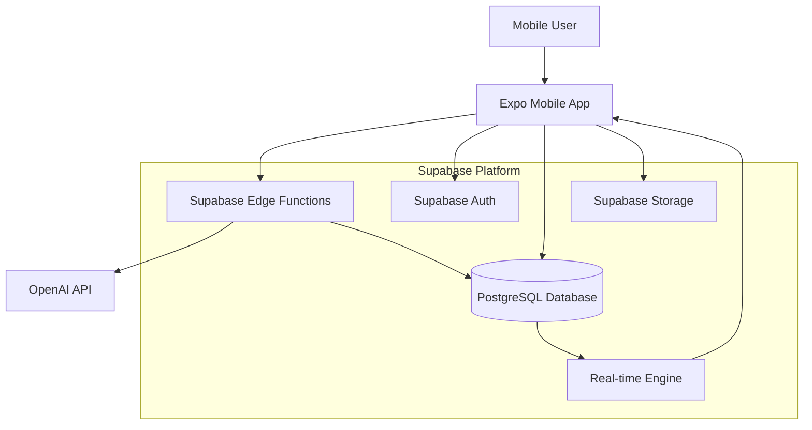
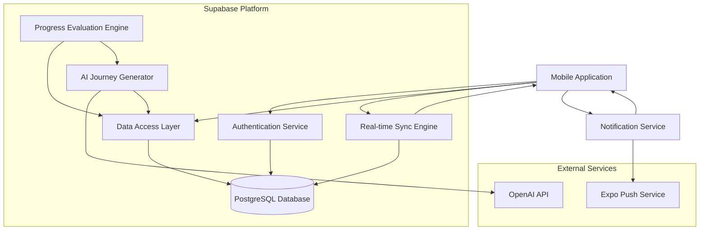
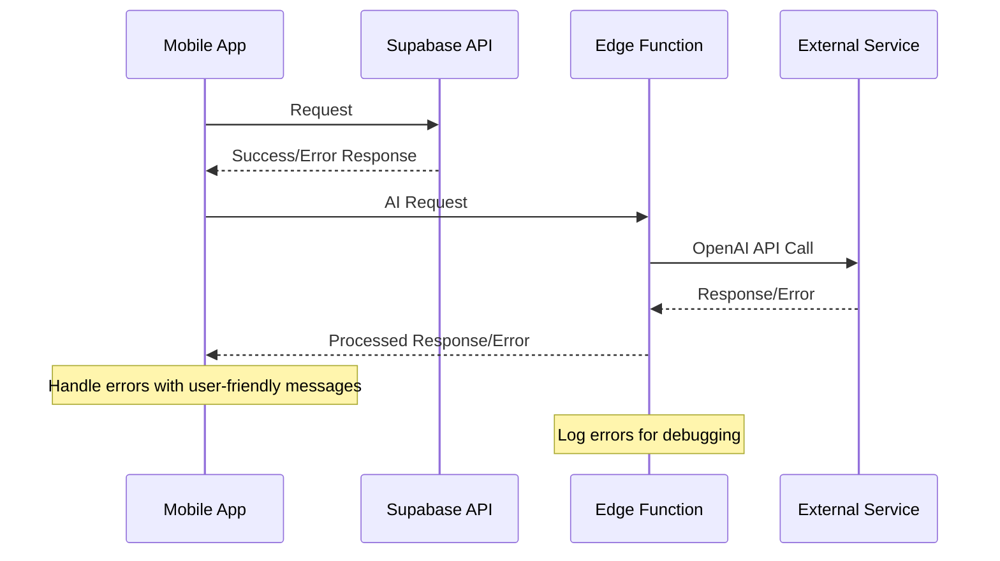

# AI Habit Tracker Fullstack Architecture Document

## Introduction

This document outlines the complete fullstack architecture for **AI Habit Tracker**, including backend systems, frontend implementation, and their integration. It serves as the single source of truth for AI-driven development, ensuring consistency across the entire technology stack.

This unified approach combines what would traditionally be separate backend and frontend architecture documents, streamlining the development process for modern fullstack applications where these concerns are increasingly intertwined.

### Starter Template or Existing Project

**Decision:** This is a greenfield project with specific technology choices already made. No starter template is mentioned, but the Expo + Supabase combination is a modern, well-supported fullstack approach.

**Rationale:** The Expo + Supabase combination provides rapid development capabilities with built-in authentication, real-time database features, and Edge Functions for serverless backend logic. This aligns well with your mobile-first approach and the AI integration requirements described in the PRD.

### Change Log

| Date | Version | Description | Author |
|------|---------|-------------|---------|
| 2025-01-30 | 1.0 | Initial architecture document | Winston (Architect) |

## High Level Architecture

### Technical Summary

AI Habit Tracker employs a mobile-first serverless architecture built on Expo (React Native) with Supabase backend services. The application leverages a RESTful API design with real-time database synchronization for seamless offline/online habit tracking. Key integration points include OpenAI API for AI-powered goal breakdown, Supabase Auth for user management, and PostgreSQL for structured data persistence. The infrastructure utilizes Supabase's global edge network for optimal performance, while the AI goal generation system runs on Supabase Edge Functions to minimize latency and ensure data privacy. This architecture achieves the PRD's goals of frictionless daily tracking, AI-guided progression, and adaptive habit journeys through a simplified tech stack that prioritizes developer velocity and user experience.

### Platform and Infrastructure Choice

**Analysis of Options:**

1. **Expo + Supabase** (Recommended)
   - **Pros:** Rapid mobile development, built-in auth/storage, real-time features, edge functions for AI processing, excellent developer experience
   - **Cons:** Vendor lock-in, less control over infrastructure
   
2. **React Native + AWS**
   - **Pros:** Enterprise scale, full control, extensive services
   - **Cons:** Complex setup, higher learning curve, more operational overhead
   
3. **Expo + Firebase**
   - **Pros:** Google ecosystem integration, mature platform
   - **Cons:** More expensive, less developer-friendly than Supabase for this use case

**Recommendation:** Expo + Supabase is optimal for this MVP given the requirements for rapid development, mobile-first design, and AI integration needs.

**Platform:** Supabase
**Key Services:** Auth, PostgreSQL, Edge Functions, Storage, Real-time subscriptions
**Deployment Host and Regions:** Supabase global edge network (US-East, Europe, Asia-Pacific)

### Repository Structure

**Structure:** Monorepo with shared packages
**Monorepo Tool:** npm workspaces (built into npm 7+)
**Package Organization:** Separation between mobile app, shared types/utilities, and potential future web dashboard

```
ai-habit-tracker/
├── apps/
│   └── mobile/          # Expo React Native app
├── packages/
│   ├── shared/          # Shared types and utilities
│   └── api-client/      # Supabase client configuration
└── supabase/            # Database migrations and edge functions
```

### High Level Architecture Diagram



### Architectural Patterns

- **Mobile-First Progressive Web Architecture:** Expo-based mobile app with potential web dashboard - _Rationale:_ Aligns with PRD's mobile-first approach while keeping web options open
- **Serverless-First Backend:** Supabase Edge Functions for AI processing and business logic - _Rationale:_ Reduces operational complexity and scales automatically with usage
- **Online-First Data Access:** Direct Supabase API calls with graceful error handling - _Rationale:_ Simplified architecture for MVP, most users have reliable connectivity for brief daily check-ins
- **Event-Driven Real-time Updates:** PostgreSQL triggers with real-time subscriptions - _Rationale:_ Enables responsive UI updates and future collaborative features
- **API Gateway Pattern:** Supabase Auto-API with Row Level Security - _Rationale:_ Reduces boilerplate while maintaining security through database-level policies
- **Repository Pattern:** Data access abstraction over Supabase client - _Rationale:_ Enables testing and potential future migration flexibility

## Tech Stack

This is the **DEFINITIVE** technology selection for the entire project. This table is the single source of truth - all development must use these exact versions.

| Category | Technology | Version | Purpose | Rationale |
|----------|------------|---------|---------|-----------|
| Frontend Language | TypeScript | ^5.3.0 | Type-safe mobile development | Strong typing prevents runtime errors, excellent tooling support with Expo |
| Frontend Framework | Expo SDK | ^50.0.0 | React Native mobile app framework | Managed workflow simplifies deployment, built-in modules for native features |
| UI Component Library | React Native Elements | ^3.4.3 | Pre-built mobile UI components | Consistent design system, accessibility built-in, customizable |
| State Management | Zustand | ^4.4.0 | Lightweight state management | Simple API, minimal boilerplate, excellent TypeScript support |
| Backend Language | TypeScript | ^5.3.0 | Unified language across stack | Code sharing between frontend/backend, reduced context switching |
| Backend Framework | Supabase Edge Functions | Latest | Serverless function runtime | Built-in integration with Supabase services, global edge deployment |
| API Style | REST with Supabase Auto-API | Latest | Database-generated REST API | Reduces boilerplate, automatic CRUD operations, real-time subscriptions |
| Database | PostgreSQL | 15+ | Primary data store | ACID compliance, JSON support, excellent Supabase integration |
| File Storage | Supabase Storage | Latest | User avatars and app assets | Integrated with auth system, CDN distribution |
| Authentication | Supabase Auth | Latest | User authentication & authorization | Social logins, row-level security, JWT tokens |
| Frontend Testing | Jest + React Native Testing Library | ^29.0.0 / ^12.0.0 | Unit and integration testing | Standard React Native testing stack |
| Backend Testing | Jest + Supertest | ^29.0.0 / ^6.3.0 | API testing | HTTP endpoint testing for edge functions |
| Build Tool | Expo CLI | ^6.3.0 | Mobile app build and deployment | Handles iOS/Android builds, OTA updates |
| Bundler | Metro (Expo) | Latest | JavaScript bundling | Optimized for React Native, built into Expo |
| IaC Tool | Supabase CLI | Latest | Database migrations and deployment | Version-controlled schema changes |
| CI/CD | GitHub Actions + EAS Build | Latest | Automated testing and deployment | Free for open source, excellent Expo integration |
| Monitoring | Flipper + Supabase Dashboard | Latest | Development debugging and analytics | Real-time debugging, built-in analytics |
| Logging | React Native Logs + Supabase Logs | Latest | Application logging | Centralized logging across mobile and backend |
| CSS Framework | NativeWind | ^2.0.11 | Tailwind CSS for React Native | Familiar utility classes, responsive design |

**Key Integration Points:**
- **AI Service:** OpenAI API (latest) for goal breakdown and habit generation
- **Network Handling:** Expo NetInfo for connectivity detection
- **Push Notifications:** Expo Notifications for habit reminders
- **Analytics:** Expo Analytics for user behavior tracking

**MVP-Focused Architecture Benefits:**
- **Reduced Complexity:** No offline sync, caching layers, or complex E2E test setup
- **Faster Development:** Direct API calls with standard error handling patterns
- **Lean Stack:** Essential tools only - can add caching and advanced testing post-MVP
- **Better UX:** Real-time updates through Supabase subscriptions without additional complexity
- **Easier Testing:** Unit tests and manual testing for MVP validation

## Data Models

Based on PRD requirements, these are the core data models that represent the key business entities for the AI Habit Tracker:

### User
**Purpose:** Represents an individual user with their profile information and preferences

**Key Attributes:**
- `id`: string (UUID) - Unique user identifier from Supabase Auth
- `email`: string - User's email address
- `name`: string | null - Display name (optional)
- `avatar_url`: string | null - Profile picture URL
- `created_at`: Date - Account creation timestamp
- `updated_at`: Date - Last profile update
- `timezone`: string - User's timezone for habit scheduling
- `notification_preferences`: NotificationSettings - Push notification preferences

**TypeScript Interface:**
```typescript
interface User {
  id: string;
  email: string;
  name: string | null;
  avatar_url: string | null;
  created_at: Date;
  updated_at: Date;
  timezone: string;
  notification_preferences: NotificationSettings;
}

interface NotificationSettings {
  daily_reminder: boolean;
  weekly_summary: boolean;
  level_up_celebration: boolean;
  preferred_time: string; // HH:MM format
}
```

**Relationships:**
- One-to-many with Journey (a user can have multiple goals/journeys)

### Journey
**Purpose:** Represents a user's long-term goal broken down by AI into a structured roadmap

**Key Attributes:**
- `id`: string (UUID) - Unique journey identifier
- `user_id`: string - Foreign key to User
- `title`: string - Goal title (e.g., "Learn Spanish", "Get Fit")
- `description`: string - Original goal description from user
- `ai_generated_plan`: AIGeneratedPlan - Complete roadmap from AI
- `current_stage_id`: string | null - Current active stage
- `status`: JourneyStatus - Current journey state
- `created_at`: Date - Journey creation date
- `updated_at`: Date - Last modification
- `completed_at`: Date | null - Completion timestamp

**TypeScript Interface:**
```typescript
interface Journey {
  id: string;
  user_id: string;
  title: string;
  description: string;
  ai_generated_plan: AIGeneratedPlan;
  current_stage_id: string | null;
  status: JourneyStatus;
  created_at: Date;
  updated_at: Date;
  completed_at: Date | null;
}

type JourneyStatus = 'active' | 'paused' | 'completed' | 'abandoned';

interface AIGeneratedPlan {
  total_stages: number;
  estimated_duration_weeks: number;
  difficulty_level: 'beginner' | 'intermediate' | 'advanced';
  ai_reasoning: string;
}
```

**Relationships:**
- Many-to-one with User
- One-to-many with Stage

### Stage
**Purpose:** Represents a weekly unit in the journey with specific success criteria

**Key Attributes:**
- `id`: string (UUID) - Unique stage identifier
- `journey_id`: string - Foreign key to Journey
- `stage_number`: number - Sequential order (1, 2, 3...)
- `title`: string - Week's focus (e.g., "Week 1: Basic Vocabulary")
- `description`: string - What user should accomplish this week
- `daily_habit_prompt`: string - The yes/no question for daily tracking
- `success_criteria`: SuccessCriteria - Rules for advancing to next stage
- `status`: StageStatus - Current stage state
- `started_at`: Date | null - When user began this stage
- `completed_at`: Date | null - When stage was completed

**TypeScript Interface:**
```typescript
interface Stage {
  id: string;
  journey_id: string;
  stage_number: number;
  title: string;
  description: string;
  daily_habit_prompt: string;
  success_criteria: SuccessCriteria;
  status: StageStatus;
  started_at: Date | null;
  completed_at: Date | null;
}

type StageStatus = 'upcoming' | 'active' | 'completed' | 'failed' | 'replanning';

interface SuccessCriteria {
  target_days_per_week: number; // e.g., 3 out of 7 days
  required_consecutive_weeks: number; // e.g., 2 weeks in a row
}
```

**Relationships:**
- Many-to-one with Journey
- One-to-many with Task (daily check-ins)

### Task
**Purpose:** Represents a daily binary check-in (Yes/No/Skip) for habit tracking

**Key Attributes:**
- `id`: string (UUID) - Unique task identifier
- `stage_id`: string - Foreign key to Stage
- `user_id`: string - Foreign key to User (for easy querying)
- `date`: Date - The specific day this task is for
- `response`: TaskResponse | null - User's response (null if not completed)
- `completed_at`: Date | null - When user responded
- `created_at`: Date - Task creation timestamp

**TypeScript Interface:**
```typescript
interface Task {
  id: string;
  stage_id: string;
  user_id: string;
  date: Date;
  response: TaskResponse | null;
  completed_at: Date | null;
  created_at: Date;
}

type TaskResponse = 'yes' | 'no' | 'skip';
```

**Relationships:**
- Many-to-one with Stage
- Many-to-one with User

**Design Rationale:**
- **UUID Primary Keys:** Ensures global uniqueness and security (non-guessable IDs)
- **Denormalized user_id in Task:** Enables efficient user-specific queries without joins
- **JSON Fields for Metadata:** AI plan data and notification preferences stored as JSON for flexibility
- **Enum Types:** Clear, type-safe status values that prevent invalid states
- **Nullable Fields:** Supports optional data and different lifecycle states

## API Specification

Since we're using Supabase Auto-API, most CRUD operations are automatically generated from our database schema with Row Level Security policies. However, we need custom Edge Functions for AI-powered features and complex business logic.

### REST API Specification

```yaml
openapi: 3.0.0
info:
  title: AI Habit Tracker API
  version: 1.0.0
  description: API for AI-powered habit tracking with goal breakdown and progress management
servers:
  - url: https://{project-id}.supabase.co/rest/v1
    description: Supabase Auto-API (CRUD operations)
  - url: https://{project-id}.supabase.co/functions/v1
    description: Supabase Edge Functions (AI & business logic)

paths:
  # Auto-generated CRUD endpoints (via Supabase)
  /users:
    get:
      summary: Get user profile
      security: [Bearer: []]
      responses:
        200:
          description: User profile data
          content:
            application/json:
              schema:
                $ref: '#/components/schemas/User'

  /journeys:
    get:
      summary: List user's journeys
      security: [Bearer: []]
      responses:
        200:
          description: Array of user journeys
          content:
            application/json:
              schema:
                type: array
                items:
                  $ref: '#/components/schemas/Journey'
    post:
      summary: Create new journey (calls AI generation)
      security: [Bearer: []]
      requestBody:
        content:
          application/json:
            schema:
              type: object
              properties:
                title:
                  type: string
                  example: "Learn Spanish"
                description:
                  type: string
                  example: "I want to become conversational in Spanish for my trip to Mexico"
      responses:
        201:
          description: Journey created with AI-generated plan
          content:
            application/json:
              schema:
                $ref: '#/components/schemas/Journey'

  # Custom Edge Functions
  /functions/v1/generate-journey:
    post:
      summary: AI-powered journey generation
      security: [Bearer: []]
      requestBody:
        content:
          application/json:
            schema:
              type: object
              properties:
                goal_description:
                  type: string
                user_context:
                  type: object
      responses:
        200:
          description: AI-generated journey plan
          content:
            application/json:
              schema:
                $ref: '#/components/schemas/AIGeneratedPlan'

  /functions/v1/replan-journey:
    post:
      summary: AI-powered journey replanning
      security: [Bearer: []]
      requestBody:
        content:
          application/json:
            schema:
              type: object
              properties:
                journey_id:
                  type: string
                failure_reason:
                  type: string
      responses:
        200:
          description: Updated journey plan

  /functions/v1/check-stage-progression:
    post:
      summary: Evaluate if user can advance to next stage
      security: [Bearer: []]
      requestBody:
        content:
          application/json:
            schema:
              type: object
              properties:
                stage_id:
                  type: string
      responses:
        200:
          description: Progression evaluation result
          content:
            application/json:
              schema:
                type: object
                properties:
                  can_advance:
                    type: boolean
                  next_action:
                    type: string
                    enum: [advance, retry, replan]
```

**Key Authentication Notes:**
- All endpoints require JWT authentication via Supabase Auth
- Row Level Security policies enforce user data isolation
- Edge Functions validate JWT tokens and user permissions

**Error Handling:**
- Standard HTTP status codes (400, 401, 403, 404, 500)
- Consistent error response format following Supabase conventions
- AI service errors are handled gracefully with fallback responses

## Components

Based on the architectural patterns, tech stack, and data models, here are the major logical components across the fullstack:

### Mobile Application (Frontend)

**Responsibility:** Provides the user interface for daily habit tracking, goal setup, and progress visualization

**Key Interfaces:**
- Navigation: Stack and tab navigation using React Navigation
- State Management: Zustand stores for app state
- API Client: Supabase client for data operations
- Real-time Subscriptions: WebSocket connections for live updates

**Dependencies:** Supabase API, Authentication Service, Push Notification Service

**Technology Stack:** Expo (React Native), TypeScript, React Native Elements, NativeWind, Zustand

### Authentication Service (Supabase Auth)

**Responsibility:** Handles user registration, login, session management, and JWT token validation

**Key Interfaces:**
- SignUp/SignIn: Email, social login (Google, Apple)
- Session Management: JWT token refresh and validation
- Row Level Security: Database access control

**Dependencies:** Supabase platform services

**Technology Stack:** Supabase Auth, JWT tokens, OAuth providers

### Data Access Layer

**Responsibility:** Abstracts database operations and provides type-safe data access patterns

**Key Interfaces:**
- Repository Pattern: Abstract data operations (UserRepository, JourneyRepository, etc.)
- Supabase Client: Direct database operations
- Real-time Subscriptions: Live data updates

**Dependencies:** PostgreSQL database, Supabase client

**Technology Stack:** Supabase Auto-API, PostgreSQL, TypeScript interfaces

### AI Journey Generator (Edge Function)

**Responsibility:** Transforms user goals into structured habit journeys using AI

**Key Interfaces:**
- Goal Processing: Natural language goal analysis
- Journey Creation: Structured roadmap generation
- Context Analysis: User experience level and preferences

**Dependencies:** OpenAI API, User context data, Journey templates

**Technology Stack:** Supabase Edge Functions, OpenAI API, TypeScript

### Progress Evaluation Engine (Edge Function)

**Responsibility:** Evaluates user progress and determines stage advancement eligibility

**Key Interfaces:**
- Progress Calculation: Analyze task completion patterns
- Stage Advancement: Apply success criteria logic
- Failure Detection: Identify when replanning is needed

**Dependencies:** Task history, Stage success criteria, Journey data

**Technology Stack:** Supabase Edge Functions, PostgreSQL triggers, TypeScript

### Notification Service

**Responsibility:** Manages push notifications for habit reminders and progress updates

**Key Interfaces:**
- Scheduled Notifications: Daily habit reminders
- Achievement Notifications: Level-up celebrations
- Re-engagement: Missed habit notifications

**Dependencies:** User notification preferences, Journey status, Expo Push Service

**Technology Stack:** Expo Notifications, Supabase Edge Functions for scheduling

### Real-time Sync Engine

**Responsibility:** Provides live updates between database changes and mobile app

**Key Interfaces:**
- WebSocket Connections: Real-time database subscriptions
- State Synchronization: Keep app state current with server
- Conflict Resolution: Handle concurrent updates

**Dependencies:** PostgreSQL triggers, Supabase Realtime

**Technology Stack:** Supabase Realtime, WebSocket connections, PostgreSQL triggers

### Component Interaction Diagram



**Component Design Rationale:**
- **Separation of Concerns:** Each component has a single, well-defined responsibility
- **Loose Coupling:** Components interact through well-defined interfaces
- **Scalability:** Edge Functions can scale independently based on demand
- **Testability:** Clear boundaries enable effective unit and integration testing
- **Reusability:** Components like AI Generation can be extended for different goal types

## Database Schema

Transform the conceptual data models into concrete PostgreSQL schemas with proper constraints, indexes, and relationships:

```sql
-- Enable UUID extension
CREATE EXTENSION IF NOT EXISTS "uuid-ossp";

-- Users table (extends Supabase auth.users)
CREATE TABLE public.users (
  id UUID REFERENCES auth.users(id) PRIMARY KEY,
  email TEXT NOT NULL,
  name TEXT,
  avatar_url TEXT,
  timezone TEXT NOT NULL DEFAULT 'UTC',
  notification_preferences JSONB NOT NULL DEFAULT '{
    "daily_reminder": true,
    "weekly_summary": true,
    "level_up_celebration": true,
    "preferred_time": "08:00"
  }'::jsonb,
  created_at TIMESTAMP WITH TIME ZONE DEFAULT NOW(),
  updated_at TIMESTAMP WITH TIME ZONE DEFAULT NOW()
);

-- Journeys table
CREATE TABLE public.journeys (
  id UUID DEFAULT uuid_generate_v4() PRIMARY KEY,
  user_id UUID REFERENCES public.users(id) ON DELETE CASCADE NOT NULL,
  title TEXT NOT NULL CHECK (length(title) <= 100),
  description TEXT NOT NULL CHECK (length(description) <= 1000),
  ai_generated_plan JSONB NOT NULL,
  current_stage_id UUID,
  status TEXT NOT NULL DEFAULT 'active' CHECK (status IN ('active', 'paused', 'completed', 'abandoned')),
  created_at TIMESTAMP WITH TIME ZONE DEFAULT NOW(),
  updated_at TIMESTAMP WITH TIME ZONE DEFAULT NOW(),
  completed_at TIMESTAMP WITH TIME ZONE
);

-- Stages table
CREATE TABLE public.stages (
  id UUID DEFAULT uuid_generate_v4() PRIMARY KEY,
  journey_id UUID REFERENCES public.journeys(id) ON DELETE CASCADE NOT NULL,
  stage_number INTEGER NOT NULL CHECK (stage_number > 0),
  title TEXT NOT NULL CHECK (length(title) <= 200),
  description TEXT NOT NULL CHECK (length(description) <= 500),
  daily_habit_prompt TEXT NOT NULL CHECK (length(daily_habit_prompt) <= 300),
  success_criteria JSONB NOT NULL DEFAULT '{
    "target_days_per_week": 3,
    "required_consecutive_weeks": 2
  }'::jsonb,
  status TEXT NOT NULL DEFAULT 'upcoming' CHECK (status IN ('upcoming', 'active', 'completed', 'failed', 'replanning')),
  started_at TIMESTAMP WITH TIME ZONE,
  completed_at TIMESTAMP WITH TIME ZONE,
  created_at TIMESTAMP WITH TIME ZONE DEFAULT NOW(),
  
  UNIQUE(journey_id, stage_number)
);

-- Tasks table
CREATE TABLE public.tasks (
  id UUID DEFAULT uuid_generate_v4() PRIMARY KEY,
  stage_id UUID REFERENCES public.stages(id) ON DELETE CASCADE NOT NULL,
  user_id UUID REFERENCES public.users(id) ON DELETE CASCADE NOT NULL,
  date DATE NOT NULL,
  response TEXT CHECK (response IN ('yes', 'no', 'skip')),
  completed_at TIMESTAMP WITH TIME ZONE,
  created_at TIMESTAMP WITH TIME ZONE DEFAULT NOW(),
  
  UNIQUE(stage_id, date)
);

-- Add foreign key constraint for current_stage_id after stages table is created
ALTER TABLE public.journeys 
ADD CONSTRAINT fk_current_stage 
FOREIGN KEY (current_stage_id) REFERENCES public.stages(id);

-- Indexes for performance
CREATE INDEX idx_journeys_user_id ON public.journeys(user_id);
CREATE INDEX idx_journeys_status ON public.journeys(status);
CREATE INDEX idx_stages_journey_id ON public.stages(journey_id);
CREATE INDEX idx_stages_status ON public.stages(status);
CREATE INDEX idx_tasks_user_id ON public.tasks(user_id);
CREATE INDEX idx_tasks_stage_id ON public.stages(stage_id);
CREATE INDEX idx_tasks_date ON public.tasks(date);
CREATE INDEX idx_tasks_user_date ON public.tasks(user_id, date);

-- Updated_at trigger function
CREATE OR REPLACE FUNCTION update_updated_at_column()
RETURNS TRIGGER AS $$
BEGIN
    NEW.updated_at = NOW();
    RETURN NEW;
END;
$$ language 'plpgsql';

-- Apply updated_at triggers
CREATE TRIGGER update_users_updated_at BEFORE UPDATE ON public.users 
    FOR EACH ROW EXECUTE FUNCTION update_updated_at_column();
CREATE TRIGGER update_journeys_updated_at BEFORE UPDATE ON public.journeys 
    FOR EACH ROW EXECUTE FUNCTION update_updated_at_column();

-- Row Level Security (RLS) policies
ALTER TABLE public.users ENABLE ROW LEVEL SECURITY;
ALTER TABLE public.journeys ENABLE ROW LEVEL SECURITY;
ALTER TABLE public.stages ENABLE ROW LEVEL SECURITY;
ALTER TABLE public.tasks ENABLE ROW LEVEL SECURITY;

-- Users can only access their own data
CREATE POLICY "Users can view own profile" ON public.users
    FOR SELECT USING (auth.uid() = id);
CREATE POLICY "Users can update own profile" ON public.users
    FOR UPDATE USING (auth.uid() = id);

-- Journey policies
CREATE POLICY "Users can view own journeys" ON public.journeys
    FOR SELECT USING (auth.uid() = user_id);
CREATE POLICY "Users can create own journeys" ON public.journeys
    FOR INSERT WITH CHECK (auth.uid() = user_id);
CREATE POLICY "Users can update own journeys" ON public.journeys
    FOR UPDATE USING (auth.uid() = user_id);
CREATE POLICY "Users can delete own journeys" ON public.journeys
    FOR DELETE USING (auth.uid() = user_id);

-- Stage policies (inherit from journey ownership)
CREATE POLICY "Users can view own stages" ON public.stages
    FOR SELECT USING (
        EXISTS (SELECT 1 FROM public.journeys WHERE id = journey_id AND user_id = auth.uid())
    );
CREATE POLICY "Users can manage own stages" ON public.stages
    FOR ALL USING (
        EXISTS (SELECT 1 FROM public.journeys WHERE id = journey_id AND user_id = auth.uid())
    );

-- Task policies
CREATE POLICY "Users can view own tasks" ON public.tasks
    FOR SELECT USING (auth.uid() = user_id);
CREATE POLICY "Users can create own tasks" ON public.tasks
    FOR INSERT WITH CHECK (auth.uid() = user_id);
CREATE POLICY "Users can update own tasks" ON public.tasks
    FOR UPDATE USING (auth.uid() = user_id);
```

**Schema Design Considerations:**
- **RLS Policies:** Ensure complete data isolation between users
- **Constraints:** Prevent invalid data entry with CHECK constraints
- **Indexes:** Optimized for common query patterns (user-specific data, date ranges)
- **Triggers:** Automatic timestamp management for audit trails
- **JSONB Fields:** Flexible storage for AI-generated content and user preferences
- **Cascading Deletes:** Maintain referential integrity when journeys are deleted

## Unified Project Structure

Monorepo structure accommodating both mobile app and backend services with shared packages:

```
ai-habit-tracker/
├── .github/                    # CI/CD workflows
│   └── workflows/
│       ├── ci.yaml
│       ├── test.yaml
│       └── deploy.yaml
├── apps/                       # Application packages
│   └── mobile/                 # Expo React Native app
│       ├── src/
│       │   ├── components/     # UI components
│       │   │   ├── common/     # Reusable components
│       │   │   ├── journey/    # Journey-specific components
│       │   │   └── habit/      # Daily habit components
│       │   ├── screens/        # Screen components
│       │   │   ├── auth/       # Authentication screens
│       │   │   ├── journey/    # Journey management screens
│       │   │   ├── habit/      # Daily habit tracking
│       │   │   └── profile/    # User profile screens
│       │   ├── navigation/     # Navigation configuration
│       │   ├── services/       # API client services
│       │   ├── stores/         # Zustand state management
│       │   ├── hooks/          # Custom React hooks
│       │   ├── utils/          # Frontend utilities
│       │   └── types/          # Frontend-specific types
│       ├── assets/             # Images, fonts, etc.
│       ├── app.config.js       # Expo configuration
│       ├── package.json
│       └── README.md
├── packages/                   # Shared packages
│   ├── shared/                 # Shared types and utilities
│   │   ├── src/
│   │   │   ├── types/          # TypeScript interfaces
│   │   │   │   ├── api.ts      # API request/response types
│   │   │   │   ├── database.ts # Database entity types
│   │   │   │   └── index.ts    # Exported types
│   │   │   ├── constants/      # Shared constants
│   │   │   ├── utils/          # Shared utilities
│   │   │   └── validation/     # Shared validation schemas
│   │   └── package.json
│   └── api-client/             # Supabase client configuration
│       ├── src/
│       │   ├── client.ts       # Supabase client setup
│       │   ├── repositories/   # Data access patterns
│       │   └── types.ts        # Client-specific types
│       └── package.json
├── supabase/                   # Database and Edge Functions
│   ├── migrations/             # Database migrations
│   │   ├── 20250130000001_initial_schema.sql
│   │   ├── 20250130000002_add_indexes.sql
│   │   └── 20250130000003_add_rls_policies.sql
│   ├── functions/              # Edge Functions
│   │   ├── generate-journey/   # AI journey generation
│   │   │   ├── index.ts
│   │   │   └── package.json
│   │   ├── replan-journey/     # AI journey replanning
│   │   │   ├── index.ts
│   │   │   └── package.json
│   │   └── check-progression/  # Stage progression logic
│   │       ├── index.ts
│   │       └── package.json
│   ├── seed.sql                # Development seed data
│   └── config.toml             # Supabase configuration
├── docs/                       # Documentation
│   ├── api.md                  # API documentation
│   ├── deployment.md           # Deployment guide
│   └── development.md          # Development setup
├── scripts/                    # Build/deploy scripts
│   ├── setup.sh                # Initial project setup
│   ├── deploy.sh               # Deployment script
│   └── seed-dev.sh             # Development data seeding
├── .env.example                # Environment template
├── .gitignore
├── package.json                # Root package.json with workspaces
├── turbo.json                  # Turborepo configuration (optional)
└── README.md
```

**Project Structure Benefits:**
- **Clear Separation:** Apps vs packages vs infrastructure
- **Type Safety:** Shared types ensure consistency across stack
- **Efficient Development:** Hot reloading and shared package updates
- **Scalable:** Easy to add web dashboard or additional mobile apps
- **Version Control:** Independent versioning for each package

## Development Workflow

### Local Development Setup

**Prerequisites:**
```bash
# Install Node.js 18+ and npm
node --version  # Should be 18+
npm --version   # Should be 8+

# Install Expo CLI globally
npm install -g @expo/cli

# Install Supabase CLI
npm install -g supabase
```

**Initial Setup:**
```bash
# Clone repository
git clone https://github.com/your-org/ai-habit-tracker.git
cd ai-habit-tracker

# Install all dependencies (monorepo)
npm install

# Set up environment variables
cp .env.example .env.local

# Initialize Supabase project
supabase init
supabase start

# Run database migrations
supabase db reset
```

**Development Commands:**
```bash
# Start mobile development server
npm run dev:mobile

# Start Supabase local development
npm run dev:supabase

# Run all tests
npm run test

# Type checking
npm run type-check

# Linting
npm run lint
```

### Environment Configuration

**Required Environment Variables:**

```bash
# Mobile App (.env.local)
EXPO_PUBLIC_SUPABASE_URL=your-supabase-url
EXPO_PUBLIC_SUPABASE_ANON_KEY=your-supabase-anon-key
EXPO_PUBLIC_OPENAI_API_KEY=your-openai-key

# Supabase Edge Functions (.env)
OPENAI_API_KEY=your-openai-key
SUPABASE_SERVICE_ROLE_KEY=your-service-role-key
```

## Deployment Architecture

### Deployment Strategy

**Mobile Deployment:**
- **Platform:** Expo Application Services (EAS)
- **Build Command:** `eas build --platform all`
- **Distribution:** App Store and Google Play Store
- **OTA Updates:** Expo Updates for JavaScript-only changes

**Backend Deployment:**
- **Platform:** Supabase Cloud
- **Database:** Automated PostgreSQL hosting
- **Edge Functions:** Automatic deployment via Supabase CLI
- **Deployment Method:** Infrastructure as Code via migrations

### CI/CD Pipeline

```yaml
# .github/workflows/deploy.yaml
name: Deploy
on:
  push:
    branches: [main]

jobs:
  test:
    runs-on: ubuntu-latest
    steps:
      - uses: actions/checkout@v3
      - uses: actions/setup-node@v3
        with:
          node-version: 18
      - run: npm ci
      - run: npm run test
      - run: npm run type-check

  deploy-backend:
    needs: test
    runs-on: ubuntu-latest
    steps:
      - uses: actions/checkout@v3
      - run: npx supabase db push
      - run: npx supabase functions deploy

  build-mobile:
    needs: test
    runs-on: ubuntu-latest
    steps:
      - uses: actions/checkout@v3
      - uses: expo/expo-github-action@v8
        with:
          expo-version: latest
          token: ${{ secrets.EXPO_TOKEN }}
      - run: eas build --platform all --non-interactive
```

### Environments

| Environment | Mobile | Backend | Purpose |
|-------------|---------|---------|---------|
| Development | Expo Dev Client | Supabase Local | Local development |
| Staging | TestFlight/Internal Testing | Supabase Staging | Pre-production testing |
| Production | App Store/Google Play | Supabase Production | Live environment |

## Coding Standards

### Critical Fullstack Rules

- **Type Sharing:** Always define types in `packages/shared` and import from there - prevents type mismatches between frontend/backend
- **API Calls:** Never make direct HTTP calls - use the repository pattern from `packages/api-client`
- **Environment Variables:** Access only through config objects, never `process.env` directly in components
- **Error Handling:** All Edge Functions must use the standard error handler with proper logging
- **State Updates:** Never mutate Zustand state directly - use proper state management patterns
- **Authentication:** Always validate JWT tokens in Edge Functions, never trust client-side auth state
- **Database Access:** Use Row Level Security policies, never bypass with service role in client code

### Naming Conventions

| Element | Frontend | Backend | Example |
|---------|----------|---------|---------|
| Components | PascalCase | - | `HabitTracker.tsx` |
| Hooks | camelCase with 'use' | - | `useJourney.ts` |
| Edge Functions | kebab-case | kebab-case | `generate-journey` |
| Database Tables | - | snake_case | `user_journeys` |
| API Endpoints | - | kebab-case | `/api/journey-progress` |

## Error Handling Strategy

### Error Flow



### Error Response Format

```typescript
interface ApiError {
  error: {
    code: string;
    message: string;
    details?: Record<string, any>;
    timestamp: string;
    requestId: string;
  };
}
```

### Frontend Error Handling

```typescript
// Global error handler for API calls
export const handleApiError = (error: any): string => {
  if (error?.response?.data?.error) {
    return error.response.data.error.message;
  }
  if (error?.message) {
    return error.message;
  }
  return 'An unexpected error occurred. Please try again.';
};

// Usage in components
const { data, error, isLoading } = useQuery({
  queryKey: ['journeys'],
  queryFn: journeyRepository.getAll,
  onError: (error) => {
    const message = handleApiError(error);
    showToast(message, 'error');
  }
});
```

### Backend Error Handling

```typescript
// Standard error handler for Edge Functions
export const handleEdgeFunctionError = (error: any, context: string) => {
  const errorId = crypto.randomUUID();
  
  console.error(`[${errorId}] ${context}:`, {
    error: error.message,
    stack: error.stack,
    timestamp: new Date().toISOString()
  });

  return new Response(
    JSON.stringify({
      error: {
        code: error.code || 'INTERNAL_ERROR',
        message: error.message || 'An unexpected error occurred',
        requestId: errorId,
        timestamp: new Date().toISOString()
      }
    }),
    {
      status: error.status || 500,
      headers: { 'Content-Type': 'application/json' }
    }
  );
};
```

## Security and Performance

### Security Requirements

**Frontend Security:**
- Environment variables properly scoped with `EXPO_PUBLIC_` prefix
- Secure token storage using Expo SecureStore
- Input validation on all user inputs before API calls

**Backend Security:**
- Row Level Security policies enforce data isolation
- JWT token validation in all Edge Functions
- Rate limiting through Supabase built-in protections
- CORS policies configured for mobile app origins only

**Authentication Security:**
- JWT tokens stored securely on device
- Automatic token refresh through Supabase client
- Session timeout after 7 days of inactivity

### Performance Optimization

**Frontend Performance:**
- Bundle size target: <10MB for mobile app
- Lazy loading for non-critical screens
- Image optimization through Expo image caching

**Backend Performance:**
- Response time target: <200ms for API calls, <2s for AI generation
- Database query optimization through proper indexing
- Edge Function cold start mitigation through keep-alive patterns

## Testing Strategy

### MVP Testing Approach

**Frontend Tests:**
```
apps/mobile/src/__tests__/
├── components/           # Component unit tests
├── hooks/               # Hook unit tests
├── services/            # API service tests
└── utils/               # Utility function tests
```

**Backend Tests:**
```
supabase/functions/__tests__/
├── generate-journey.test.ts    # AI generation tests
├── check-progression.test.ts   # Progress logic tests
└── utils.test.ts              # Shared utility tests
```

**Test Examples:**

```typescript
// Frontend component test
describe('HabitTracker', () => {
  it('should display habit prompt', () => {
    render(<HabitTracker habit="Did you practice Spanish today?" />);
    expect(screen.getByText(/practice Spanish/)).toBeInTheDocument();
  });
});

// Backend Edge Function test
describe('generate-journey', () => {
  it('should create valid journey structure', async () => {
    const response = await generateJourney({
      goal: "Learn Spanish",
      userContext: { experience: "beginner" }
    });
    
    expect(response.stages).toHaveLength.greaterThan(0);
    expect(response.estimated_duration_weeks).toBeGreaterThan(0);
  });
});
```

This completes the comprehensive fullstack architecture document for your AI Habit Tracker MVP. The architecture prioritizes rapid development while maintaining scalability and security through the Expo + Supabase tech stack.
