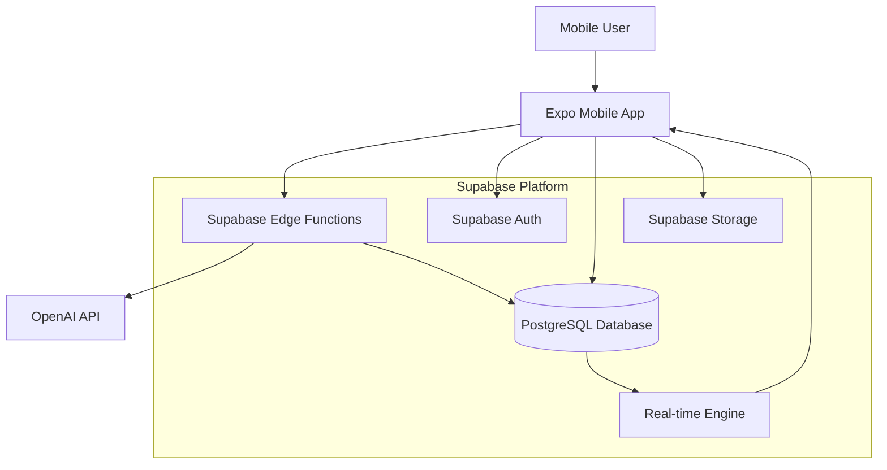

# AI Habit Tracker Fullstack Architecture Document

## Introduction

This document outlines the complete fullstack architecture for **AI Habit Tracker**, including backend systems, frontend implementation, and their integration. It serves as the single source of truth for AI-driven development, ensuring consistency across the entire technology stack.

This unified approach combines what would traditionally be separate backend and frontend architecture documents, streamlining the development process for modern fullstack applications where these concerns are increasingly intertwined.

### Starter Template or Existing Project

**Decision:** This is a greenfield project with specific technology choices already made. No starter template is mentioned, but the Expo + Supabase combination is a modern, well-supported fullstack approach.

**Rationale:** The Expo + Supabase combination provides rapid development capabilities with built-in authentication, real-time database features, and Edge Functions for serverless backend logic. This aligns well with your mobile-first approach and the AI integration requirements described in the PRD.

### Change Log

| Date | Version | Description | Author |
|------|---------|-------------|---------|
| 2025-01-30 | 1.0 | Initial architecture document | Winston (Architect) |

## High Level Architecture

### Technical Summary

AI Habit Tracker employs a mobile-first serverless architecture built on Expo (React Native) with Supabase backend services. The application leverages a RESTful API design with real-time database synchronization for seamless offline/online habit tracking. Key integration points include OpenAI API for AI-powered goal breakdown, Supabase Auth for user management, and PostgreSQL for structured data persistence. The infrastructure utilizes Supabase's global edge network for optimal performance, while the AI goal generation system runs on Supabase Edge Functions to minimize latency and ensure data privacy. This architecture achieves the PRD's goals of frictionless daily tracking, AI-guided progression, and adaptive habit journeys through a simplified tech stack that prioritizes developer velocity and user experience.

### Platform and Infrastructure Choice

**Analysis of Options:**

1. **Expo + Supabase** (Recommended)
   - **Pros:** Rapid mobile development, built-in auth/storage, real-time features, edge functions for AI processing, excellent developer experience
   - **Cons:** Vendor lock-in, less control over infrastructure
   
2. **React Native + AWS**
   - **Pros:** Enterprise scale, full control, extensive services
   - **Cons:** Complex setup, higher learning curve, more operational overhead
   
3. **Expo + Firebase**
   - **Pros:** Google ecosystem integration, mature platform
   - **Cons:** More expensive, less developer-friendly than Supabase for this use case

**Recommendation:** Expo + Supabase is optimal for this MVP given the requirements for rapid development, mobile-first design, and AI integration needs.

**Platform:** Supabase
**Key Services:** Auth, PostgreSQL, Edge Functions, Storage, Real-time subscriptions
**Deployment Host and Regions:** Supabase global edge network (US-East, Europe, Asia-Pacific)

### Repository Structure

**Structure:** Monorepo with shared packages
**Monorepo Tool:** npm workspaces (built into npm 7+)
**Package Organization:** Separation between mobile app, shared types/utilities, and potential future web dashboard

```
ai-habit-tracker/
├── apps/
│   └── mobile/          # Expo React Native app
├── packages/
│   ├── shared/          # Shared types and utilities
│   └── api-client/      # Supabase client configuration
└── supabase/            # Database migrations and edge functions
```

### High Level Architecture Diagram



### Architectural Patterns

- **Mobile-First Progressive Web Architecture:** Expo-based mobile app with potential web dashboard - _Rationale:_ Aligns with PRD's mobile-first approach while keeping web options open
- **Serverless-First Backend:** Supabase Edge Functions for AI processing and business logic - _Rationale:_ Reduces operational complexity and scales automatically with usage
- **Online-First Data Access:** Direct Supabase API calls with graceful error handling - _Rationale:_ Simplified architecture for MVP, most users have reliable connectivity for brief daily check-ins
- **Event-Driven Real-time Updates:** PostgreSQL triggers with real-time subscriptions - _Rationale:_ Enables responsive UI updates and future collaborative features
- **API Gateway Pattern:** Supabase Auto-API with Row Level Security - _Rationale:_ Reduces boilerplate while maintaining security through database-level policies
- **Repository Pattern:** Data access abstraction over Supabase client - _Rationale:_ Enables testing and potential future migration flexibility

## Tech Stack

This is the **DEFINITIVE** technology selection for the entire project. This table is the single source of truth - all development must use these exact versions.

| Category | Technology | Version | Purpose | Rationale |
|----------|------------|---------|---------|-----------|
| Frontend Language | TypeScript | ^5.3.0 | Type-safe mobile development | Strong typing prevents runtime errors, excellent tooling support with Expo |
| Frontend Framework | Expo SDK | ^50.0.0 | React Native mobile app framework | Managed workflow simplifies deployment, built-in modules for native features |
| UI Component Library | React Native Elements | ^3.4.3 | Pre-built mobile UI components | Consistent design system, accessibility built-in, customizable |
| State Management | Zustand | ^4.4.0 | Lightweight state management | Simple API, minimal boilerplate, excellent TypeScript support |
| Backend Language | TypeScript | ^5.3.0 | Unified language across stack | Code sharing between frontend/backend, reduced context switching |
| Backend Framework | Supabase Edge Functions | Latest | Serverless function runtime | Built-in integration with Supabase services, global edge deployment |
| API Style | REST with Supabase Auto-API | Latest | Database-generated REST API | Reduces boilerplate, automatic CRUD operations, real-time subscriptions |
| Database | PostgreSQL | 15+ | Primary data store | ACID compliance, JSON support, excellent Supabase integration |
| File Storage | Supabase Storage | Latest | User avatars and app assets | Integrated with auth system, CDN distribution |
| Authentication | Supabase Auth | Latest | User authentication & authorization | Social logins, row-level security, JWT tokens |
| Frontend Testing | Jest + React Native Testing Library | ^29.0.0 / ^12.0.0 | Unit and integration testing | Standard React Native testing stack |
| Backend Testing | Jest + Supertest | ^29.0.0 / ^6.3.0 | API testing | HTTP endpoint testing for edge functions |
| Build Tool | Expo CLI | ^6.3.0 | Mobile app build and deployment | Handles iOS/Android builds, OTA updates |
| Bundler | Metro (Expo) | Latest | JavaScript bundling | Optimized for React Native, built into Expo |
| IaC Tool | Supabase CLI | Latest | Database migrations and deployment | Version-controlled schema changes |
| CI/CD | GitHub Actions + EAS Build | Latest | Automated testing and deployment | Free for open source, excellent Expo integration |
| Monitoring | Flipper + Supabase Dashboard | Latest | Development debugging and analytics | Real-time debugging, built-in analytics |
| Logging | React Native Logs + Supabase Logs | Latest | Application logging | Centralized logging across mobile and backend |
| CSS Framework | NativeWind | ^2.0.11 | Tailwind CSS for React Native | Familiar utility classes, responsive design |

**Key Integration Points:**
- **AI Service:** OpenAI API (latest) for goal breakdown and habit generation
- **Network Handling:** Expo NetInfo for connectivity detection
- **Push Notifications:** Expo Notifications for habit reminders
- **Analytics:** Expo Analytics for user behavior tracking

**MVP-Focused Architecture Benefits:**
- **Reduced Complexity:** No offline sync, caching layers, or complex E2E test setup
- **Faster Development:** Direct API calls with standard error handling patterns
- **Lean Stack:** Essential tools only - can add caching and advanced testing post-MVP
- **Better UX:** Real-time updates through Supabase subscriptions without additional complexity
- **Easier Testing:** Unit tests and manual testing for MVP validation

## Data Models

Based on PRD requirements, these are the core data models that represent the key business entities for the AI Habit Tracker:

### User
**Purpose:** Represents an individual user with their profile information and preferences

**Key Attributes:**
- `id`: string (UUID) - Unique user identifier from Supabase Auth
- `email`: string - User's email address
- `name`: string | null - Display name (optional)
- `avatar_url`: string | null - Profile picture URL
- `created_at`: Date - Account creation timestamp
- `updated_at`: Date - Last profile update
- `timezone`: string - User's timezone for habit scheduling
- `notification_preferences`: NotificationSettings - Push notification preferences

**TypeScript Interface:**
```typescript
interface User {
  id: string;
  email: string;
  name: string | null;
  avatar_url: string | null;
  created_at: Date;
  updated_at: Date;
  timezone: string;
  notification_preferences: NotificationSettings;
}

interface NotificationSettings {
  daily_reminder: boolean;
  weekly_summary: boolean;
  level_up_celebration: boolean;
  preferred_time: string; // HH:MM format
}
```

**Relationships:**
- One-to-many with Journey (a user can have multiple goals/journeys)

### Journey
**Purpose:** Represents a user's long-term goal broken down by AI into a structured roadmap

**Key Attributes:**
- `id`: string (UUID) - Unique journey identifier
- `user_id`: string - Foreign key to User
- `title`: string - Goal title (e.g., "Learn Spanish", "Get Fit")
- `description`: string - Original goal description from user
- `ai_generated_plan`: AIGeneratedPlan - Complete roadmap from AI
- `current_stage_id`: string | null - Current active stage
- `status`: JourneyStatus - Current journey state
- `created_at`: Date - Journey creation date
- `updated_at`: Date - Last modification
- `completed_at`: Date | null - Completion timestamp

**TypeScript Interface:**
```typescript
interface Journey {
  id: string;
  user_id: string;
  title: string;
  description: string;
  ai_generated_plan: AIGeneratedPlan;
  current_stage_id: string | null;
  status: JourneyStatus;
  created_at: Date;
  updated_at: Date;
  completed_at: Date | null;
}

type JourneyStatus = 'active' | 'paused' | 'completed' | 'abandoned';

interface AIGeneratedPlan {
  total_stages: number;
  estimated_duration_weeks: number;
  difficulty_level: 'beginner' | 'intermediate' | 'advanced';
  ai_reasoning: string;
}
```

**Relationships:**
- Many-to-one with User
- One-to-many with Stage

### Stage
**Purpose:** Represents a weekly unit in the journey with specific success criteria

**Key Attributes:**
- `id`: string (UUID) - Unique stage identifier
- `journey_id`: string - Foreign key to Journey
- `stage_number`: number - Sequential order (1, 2, 3...)
- `title`: string - Week's focus (e.g., "Week 1: Basic Vocabulary")
- `description`: string - What user should accomplish this week
- `daily_habit_prompt`: string - The yes/no question for daily tracking
- `success_criteria`: SuccessCriteria - Rules for advancing to next stage
- `status`: StageStatus - Current stage state
- `started_at`: Date | null - When user began this stage
- `completed_at`: Date | null - When stage was completed

**TypeScript Interface:**
```typescript
interface Stage {
  id: string;
  journey_id: string;
  stage_number: number;
  title: string;
  description: string;
  daily_habit_prompt: string;
  success_criteria: SuccessCriteria;
  status: StageStatus;
  started_at: Date | null;
  completed_at: Date | null;
}

type StageStatus = 'upcoming' | 'active' | 'completed' | 'failed' | 'replanning';

interface SuccessCriteria {
  target_days_per_week: number; // e.g., 3 out of 7 days
  required_consecutive_weeks: number; // e.g., 2 weeks in a row
}
```

**Relationships:**
- Many-to-one with Journey
- One-to-many with Task (daily check-ins)

### Task
**Purpose:** Represents a daily binary check-in (Yes/No/Skip) for habit tracking

**Key Attributes:**
- `id`: string (UUID) - Unique task identifier
- `stage_id`: string - Foreign key to Stage
- `user_id`: string - Foreign key to User (for easy querying)
- `date`: Date - The specific day this task is for
- `response`: TaskResponse | null - User's response (null if not completed)
- `completed_at`: Date | null - When user responded
- `created_at`: Date - Task creation timestamp

**TypeScript Interface:**
```typescript
interface Task {
  id: string;
  stage_id: string;
  user_id: string;
  date: Date;
  response: TaskResponse | null;
  completed_at: Date | null;
  created_at: Date;
}

type TaskResponse = 'yes' | 'no' | 'skip';
```

**Relationships:**
- Many-to-one with Stage
- Many-to-one with User

**Design Rationale:**
- **UUID Primary Keys:** Ensures global uniqueness and security (non-guessable IDs)
- **Denormalized user_id in Task:** Enables efficient user-specific queries without joins
- **JSON Fields for Metadata:** AI plan data and notification preferences stored as JSON for flexibility
- **Enum Types:** Clear, type-safe status values that prevent invalid states
- **Nullable Fields:** Supports optional data and different lifecycle states
