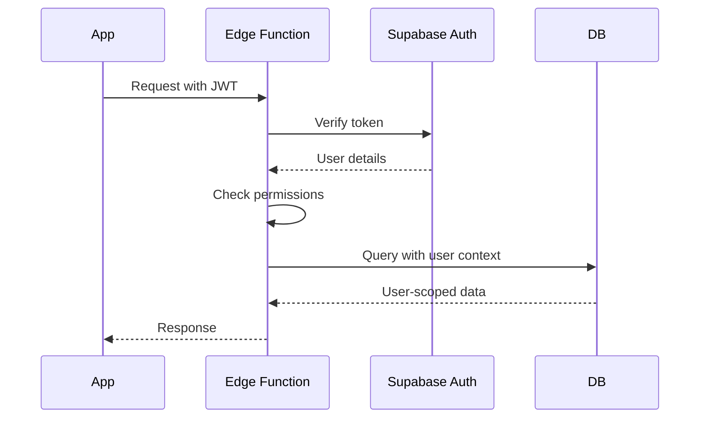

# Backend Architecture

## Service Architecture

**Function Organization:**
```
supabase/
├── functions/
│   ├── generate-roadmap/
│   │   └── index.ts
│   ├── recalibrate-roadmap/
│   │   └── index.ts
│   ├── check-weekly-progress/
│   │   └── index.ts
│   ├── edit-roadmap/
│   │   └── index.ts
│   └── _shared/
│       ├── openai.ts
│       ├── supabase.ts
│       └── types.ts
├── migrations/
│   ├── 20240301000000_initial_schema.sql
│   ├── 20240301000001_rls_policies.sql
│   └── 20240301000002_functions.sql
└── seed.sql
```

**Function Template:**
```typescript
// supabase/functions/generate-roadmap/index.ts
import { serve } from "https://deno.land/std@0.168.0/http/server.ts";
import { createClient } from "https://esm.sh/@supabase/supabase-js@2";
import { OpenAI } from "../_shared/openai.ts";
import { corsHeaders } from "../_shared/cors.ts";

interface RequestBody {
  title: string;
  description: string;
  target_date: string;
  experience_level: 'beginner' | 'intermediate' | 'advanced';
}

serve(async (req) => {
  // Handle CORS
  if (req.method === 'OPTIONS') {
    return new Response('ok', { headers: corsHeaders });
  }

  try {
    // Auth check
    const authHeader = req.headers.get('Authorization')!;
    const supabase = createClient(
      Deno.env.get('SUPABASE_URL')!,
      Deno.env.get('SUPABASE_ANON_KEY')!,
      { global: { headers: { Authorization: authHeader } } }
    );

    const { data: { user }, error: authError } = await supabase.auth.getUser();
    if (authError || !user) {
      return new Response(
        JSON.stringify({ error: 'Unauthorized' }),
        { status: 401, headers: { ...corsHeaders, 'Content-Type': 'application/json' } }
      );
    }

    // Parse request
    const { title, description, target_date, experience_level } = await req.json() as RequestBody;

    // Generate roadmap with OpenAI
    const roadmap = await OpenAI.generateRoadmap({
      title,
      description,
      target_date,
      experience_level
    });

    // Save to database
    const { data: goal, error: dbError } = await supabase
      .from('goals')
      .insert({
        user_id: user.id,
        title,
        description,
        target_date,
        roadmap
      })
      .select()
      .single();

    if (dbError) throw dbError;

    // Create weekly stages
    const stages = roadmap.stages.map((stage: any, index: number) => ({
      goal_id: goal.id,
      week_number: index + 1,
      ...stage
    }));

    await supabase.from('weekly_stages').insert(stages);

    return new Response(
      JSON.stringify({ goal, roadmap }),
      { headers: { ...corsHeaders, 'Content-Type': 'application/json' } }
    );

  } catch (error) {
    return new Response(
      JSON.stringify({ error: error.message }),
      { status: 500, headers: { ...corsHeaders, 'Content-Type': 'application/json' } }
    );
  }
});
```

## Database Architecture

**Data Access Layer:**
```typescript
// supabase/functions/_shared/repository.ts
import { SupabaseClient } from "@supabase/supabase-js";

export class GoalRepository {
  constructor(private supabase: SupabaseClient) {}

  async findActiveGoal(userId: string) {
    const { data, error } = await this.supabase
      .from('goals')
      .select(`
        *,
        weekly_stages!inner(*)
      `)
      .eq('user_id', userId)
      .eq('status', 'active')
      .single();

    if (error) throw error;
    return data;
  }

  async updateGoalProgress(goalId: string, stageId: string) {
    const { error } = await this.supabase
      .from('goals')
      .update({ current_stage_id: stageId })
      .eq('id', goalId);

    if (error) throw error;
  }
}

export class HabitLogRepository {
  constructor(private supabase: SupabaseClient) {}

  async logHabit(userId: string, stageId: string, date: string, status: string) {
    const { data, error } = await this.supabase
      .rpc('log_habit', {
        p_user_id: userId,
        p_stage_id: stageId,
        p_date: date,
        p_status: status
      });

    if (error) throw error;
    return data;
  }

  async getWeeklyLogs(stageId: string, startDate: string, endDate: string) {
    const { data, error } = await this.supabase
      .from('habit_logs')
      .select('*')
      .eq('stage_id', stageId)
      .gte('date', startDate)
      .lte('date', endDate);

    if (error) throw error;
    return data;
  }
}
```

## Authentication and Authorization

**Auth Flow:**


**Middleware/Guards:**
```typescript
// supabase/functions/_shared/auth.ts
import { SupabaseClient } from "@supabase/supabase-js";

export async function requireAuth(
  req: Request,
  supabase: SupabaseClient
): Promise<{ user: any; error?: string }> {
  const authHeader = req.headers.get('Authorization');
  
  if (!authHeader) {
    return { user: null, error: 'No authorization header' };
  }

  const { data: { user }, error } = await supabase.auth.getUser();
  
  if (error || !user) {
    return { user: null, error: 'Invalid token' };
  }

  return { user };
}

export async function requirePremium(
  userId: string,
  supabase: SupabaseClient
): Promise<boolean> {
  const { data } = await supabase
    .from('profiles')
    .select('subscription_tier')
    .eq('id', userId)
    .single();

  return data?.subscription_tier === 'premium';
}
```
