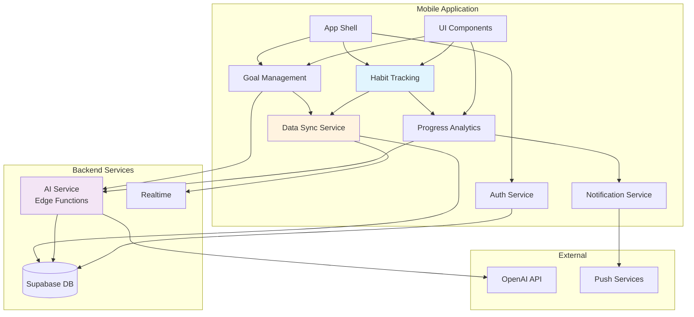

# Components

## Mobile App Shell

**Responsibility:** Root application container managing navigation, auth state, and global providers

**Key Interfaces:**
- Navigation container setup
- Auth context provider
- React Query client provider
- Push notification handler

**Dependencies:** React Navigation, Supabase Auth, React Query, Expo Notifications

**Technology Stack:** Expo SDK 50+, React Native, TypeScript

## Authentication Service

**Responsibility:** Manages user authentication, session persistence, and auth state across the app

**Key Interfaces:**
- `signUp(email, password)`: Register new user
- `signIn(email, password)`: Authenticate user
- `signOut()`: Clear session
- `getSession()`: Retrieve current auth state
- `onAuthStateChange()`: Subscribe to auth changes

**Dependencies:** Supabase Auth SDK, Secure Storage (Expo SecureStore)

**Technology Stack:** Supabase Auth, React Context for state distribution

## Goal Management Component

**Responsibility:** Handles goal creation, roadmap generation, and goal lifecycle management

**Key Interfaces:**
- `createGoal(goalData)`: Initialize new goal
- `generateRoadmap(goalParams)`: Call AI for roadmap
- `editRoadmap(goalId, stages)`: Modify AI suggestions
- `updateGoalStatus(goalId, status)`: Pause/resume/complete goals

**Dependencies:** AI Service (Edge Functions), Data Sync Service

**Technology Stack:** React Query for caching, Supabase Edge Functions for AI

## Habit Tracking Component

**Responsibility:** Core daily tracking interface and habit logging operations

**Key Interfaces:**
- `logHabit(stageId, date, status)`: Record daily completion
- `getTodayStatus(stageId)`: Check if today is logged
- `getWeekProgress(stageId)`: Calculate weekly completion
- `updateLog(logId, status, notes)`: Modify existing log

**Dependencies:** Data Sync Service, Offline Storage

**Technology Stack:** React Native UI, SQLite for offline cache, React Query mutations

## Progress Analytics Component

**Responsibility:** Calculates and displays user progress metrics and weekly summaries

**Key Interfaces:**
- `checkWeeklyCompletion(stageId)`: Evaluate stage success
- `getProgressStats(goalId)`: Overall goal metrics
- `generateWeeklySummary(stageId)`: Create progress report
- `triggerStageTransition(stageId)`: Advance to next week

**Dependencies:** Habit Tracking Component, Edge Functions

**Technology Stack:** Client-side calculations with React Query, Edge Functions for summaries

## AI Service Component

**Responsibility:** Interfaces with OpenAI for roadmap generation and recalibration

**Key Interfaces:**
- `generateInitialRoadmap(goalDescription)`: Create new AI roadmap
- `recalibrateRoadmap(goalId, reason)`: Adjust based on struggles
- `generateStageTips(stageContext)`: Provide contextual guidance

**Dependencies:** OpenAI API (via Edge Functions), Goal Management Component

**Technology Stack:** Supabase Edge Functions, OpenAI GPT-4 API, TypeScript

## Data Sync Service

**Responsibility:** Manages offline-first data synchronization between local storage and Supabase

**Key Interfaces:**
- `syncHabitLogs()`: Upload offline logs when connected
- `subscribeToChanges(channel)`: Realtime subscriptions
- `cacheData(table, data)`: Store for offline access
- `resolveConflicts(local, remote)`: Handle sync conflicts

**Dependencies:** Supabase Realtime, SQLite, Network Status Monitor

**Technology Stack:** Supabase Client, Expo SQLite, React Query persistence

## Notification Service

**Responsibility:** Manages push notifications for daily reminders and weekly celebrations

**Key Interfaces:**
- `scheduleDailyReminder(time)`: Set daily habit reminder
- `sendWeeklyComplete()`: Celebrate stage completion
- `updatePreferences(settings)`: Modify notification settings
- `requestPermissions()`: Handle OS permissions

**Dependencies:** Expo Notifications, User Preferences Store

**Technology Stack:** Expo Push Notifications, local scheduling

## UI Component Library

**Responsibility:** Reusable UI components maintaining consistent design language

**Key Interfaces:**
- `<HabitCard />`: Daily habit display and interaction
- `<ProgressRing />`: Visual progress indicator
- `<RoadmapTimeline />`: Journey visualization
- `<StageCard />`: Weekly stage information

**Dependencies:** React Native Elements, NativeWind

**Technology Stack:** React Native, TypeScript, NativeWind for styling

## Component Diagrams

