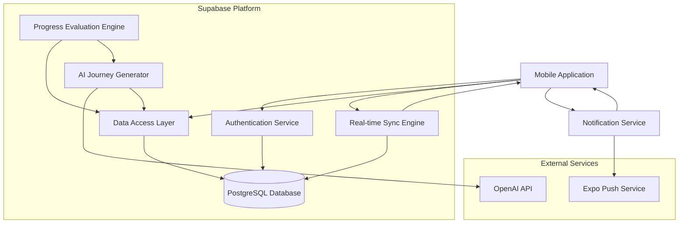

# Components

Based on the architectural patterns, tech stack, and data models, here are the major logical components across the fullstack:

## Mobile Application (Frontend)

**Responsibility:** Provides the user interface for daily habit tracking, goal setup, and progress visualization

**Key Interfaces:**
- Navigation: Stack and tab navigation using React Navigation
- State Management: Zustand stores for app state
- API Client: Supabase client for data operations
- Real-time Subscriptions: WebSocket connections for live updates

**Dependencies:** Supabase API, Authentication Service, Push Notification Service

**Technology Stack:** Expo (React Native), TypeScript, React Native Elements, NativeWind, Zustand

## Authentication Service (Supabase Auth)

**Responsibility:** Handles user registration, login, session management, and JWT token validation

**Key Interfaces:**
- SignUp/SignIn: Email, social login (Google, Apple)
- Session Management: JWT token refresh and validation
- Row Level Security: Database access control

**Dependencies:** Supabase platform services

**Technology Stack:** Supabase Auth, JWT tokens, OAuth providers

## Data Access Layer

**Responsibility:** Abstracts database operations and provides type-safe data access patterns

**Key Interfaces:**
- Repository Pattern: Abstract data operations (UserRepository, JourneyRepository, etc.)
- Supabase Client: Direct database operations
- Real-time Subscriptions: Live data updates

**Dependencies:** PostgreSQL database, Supabase client

**Technology Stack:** Supabase Auto-API, PostgreSQL, TypeScript interfaces

## AI Journey Generator (Edge Function)

**Responsibility:** Transforms user goals into structured habit journeys using AI

**Key Interfaces:**
- Goal Processing: Natural language goal analysis
- Journey Creation: Structured roadmap generation
- Context Analysis: User experience level and preferences

**Dependencies:** OpenAI API, User context data, Journey templates

**Technology Stack:** Supabase Edge Functions, OpenAI API, TypeScript

## Progress Evaluation Engine (Edge Function)

**Responsibility:** Evaluates user progress and determines stage advancement eligibility

**Key Interfaces:**
- Progress Calculation: Analyze task completion patterns
- Stage Advancement: Apply success criteria logic
- Failure Detection: Identify when replanning is needed

**Dependencies:** Task history, Stage success criteria, Journey data

**Technology Stack:** Supabase Edge Functions, PostgreSQL triggers, TypeScript

## Notification Service

**Responsibility:** Manages push notifications for habit reminders and progress updates

**Key Interfaces:**
- Scheduled Notifications: Daily habit reminders
- Achievement Notifications: Level-up celebrations
- Re-engagement: Missed habit notifications

**Dependencies:** User notification preferences, Journey status, Expo Push Service

**Technology Stack:** Expo Notifications, Supabase Edge Functions for scheduling

## Real-time Sync Engine

**Responsibility:** Provides live updates between database changes and mobile app

**Key Interfaces:**
- WebSocket Connections: Real-time database subscriptions
- State Synchronization: Keep app state current with server
- Conflict Resolution: Handle concurrent updates

**Dependencies:** PostgreSQL triggers, Supabase Realtime

**Technology Stack:** Supabase Realtime, WebSocket connections, PostgreSQL triggers

## Component Interaction Diagram

**Component Design Rationale:**
- **Separation of Concerns:** Each component has a single, well-defined responsibility
- **Loose Coupling:** Components interact through well-defined interfaces
- **Scalability:** Edge Functions can scale independently based on demand
- **Testability:** Clear boundaries enable effective unit and integration testing
- **Reusability:** Components like AI Generation can be extended for different goal types
