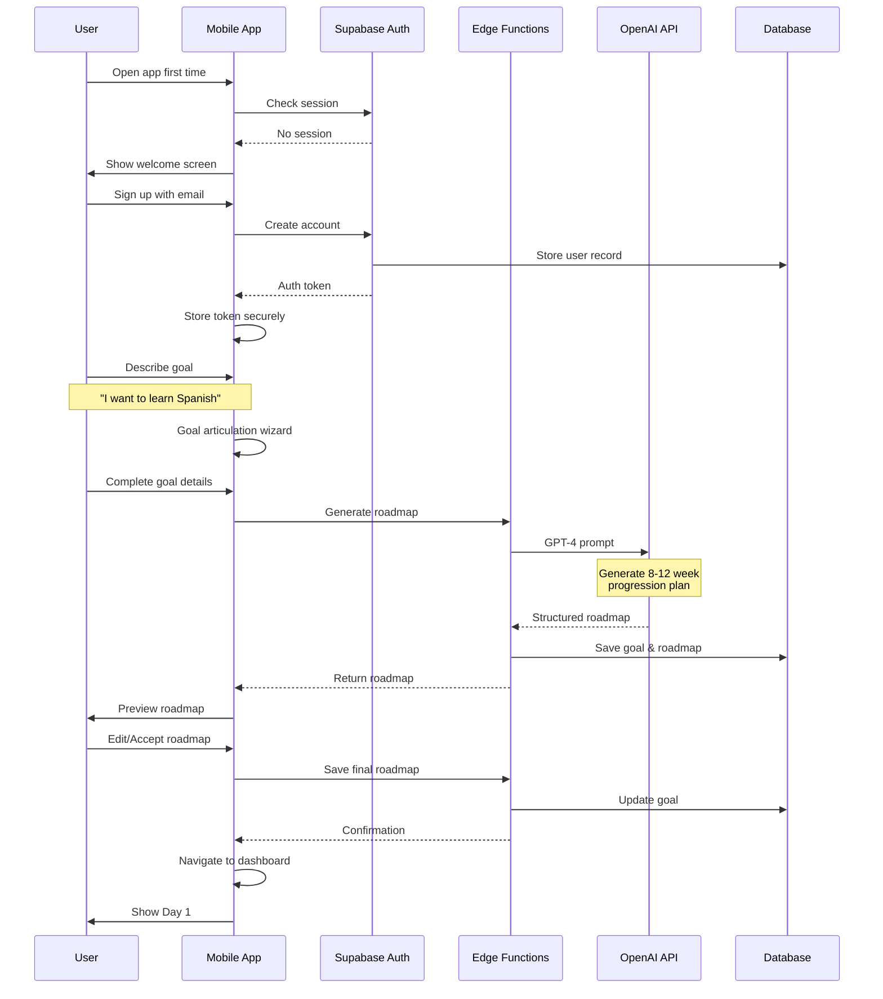
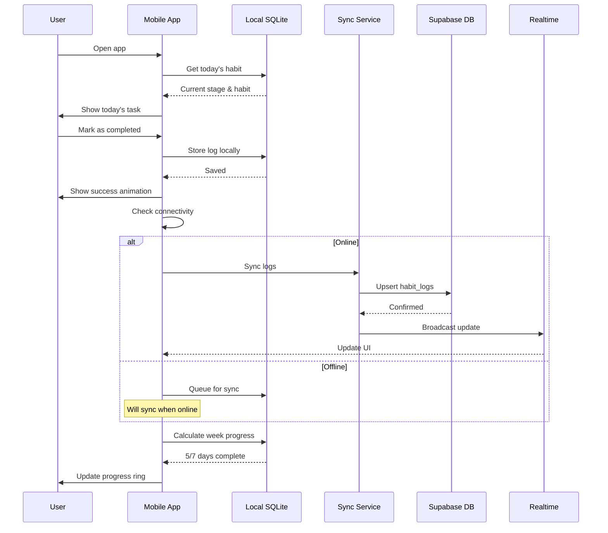
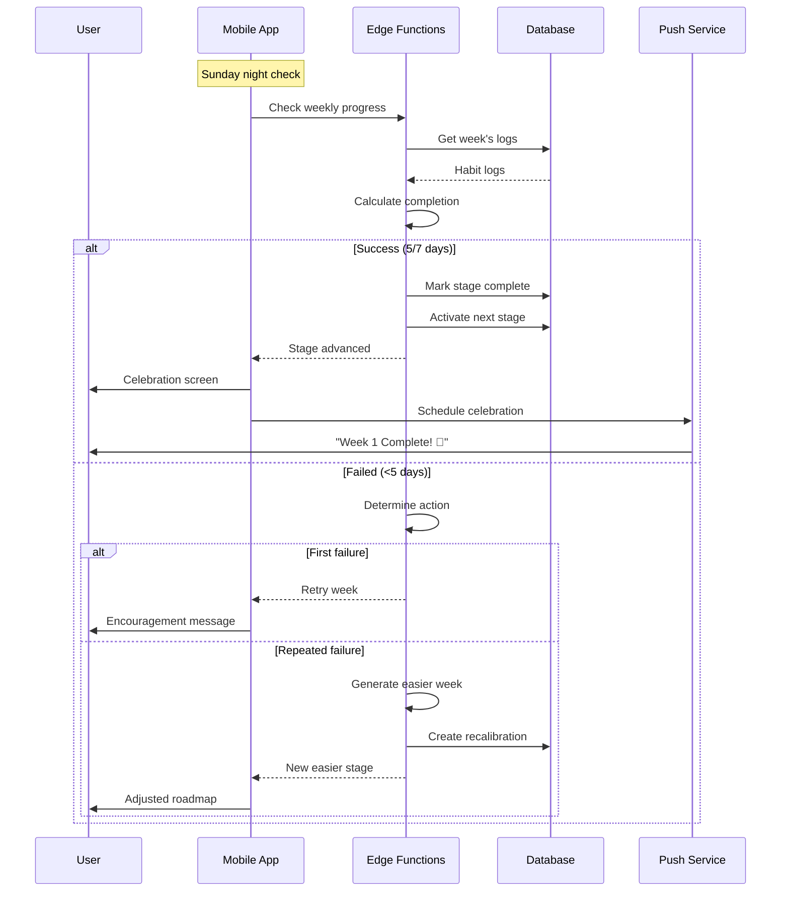
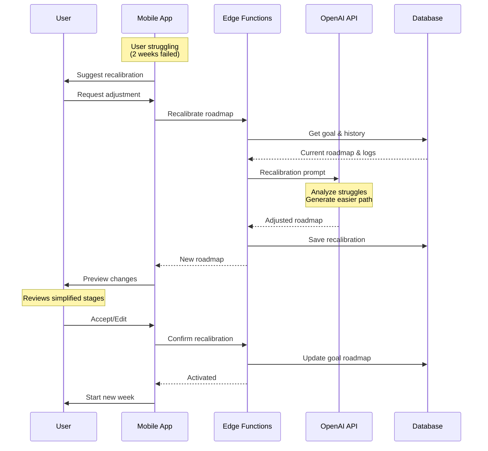
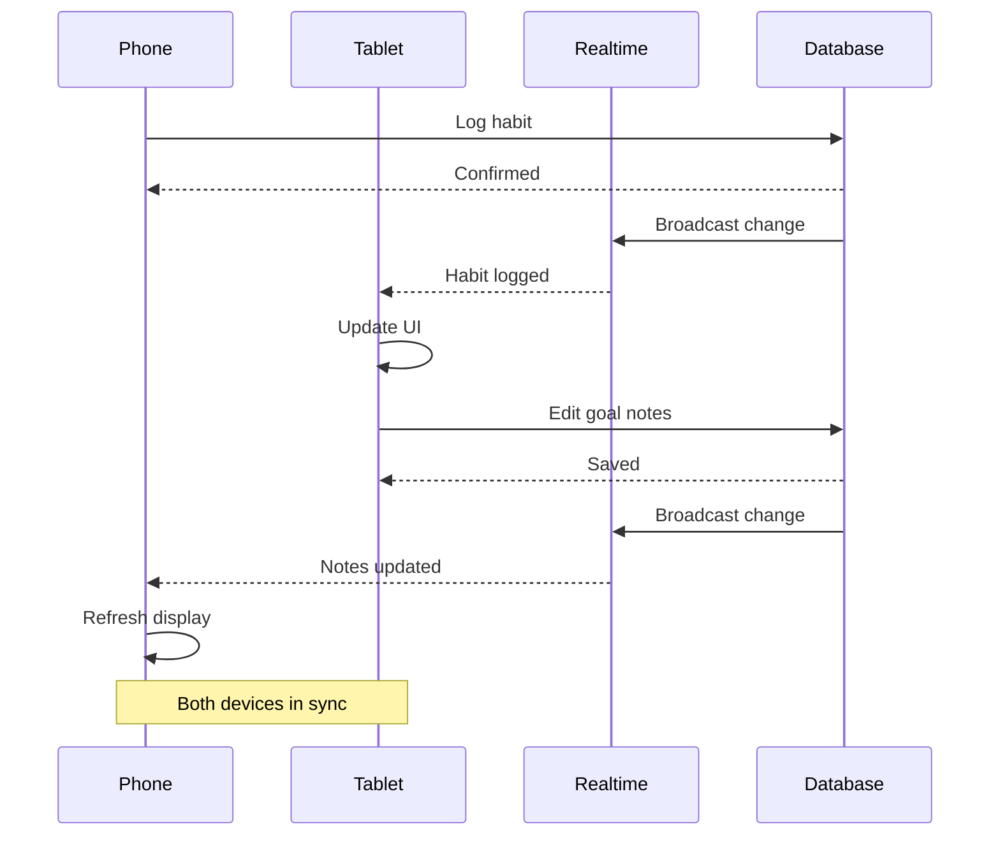

# Core Workflows

## User Onboarding & Goal Setup Workflow

```mermaid
sequenceDiagram
    participant U as User
    participant App as Mobile App
    participant Auth as Supabase Auth
    participant Edge as Edge Functions
    participant AI as OpenAI API
    participant DB as Database
    
    U->>App: Open app first time
    App->>Auth: Check session
    Auth-->>App: No session
    App->>U: Show welcome screen
    
    U->>App: Sign up with email
    App->>Auth: Create account
    Auth->>DB: Store user record
    Auth-->>App: Auth token
    App->>App: Store token securely
    
    U->>App: Describe goal
    Note over U,App: "I want to learn Spanish"
    App->>App: Goal articulation wizard
    U->>App: Complete goal details
    
    App->>Edge: Generate roadmap
    Edge->>AI: GPT-4 prompt
    Note over AI: Generate 8-12 week<br/>progression plan
    AI-->>Edge: Structured roadmap
    Edge->>DB: Save goal & roadmap
    Edge-->>App: Return roadmap
    
    App->>U: Preview roadmap
    U->>App: Edit/Accept roadmap
    App->>Edge: Save final roadmap
    Edge->>DB: Update goal
    Edge-->>App: Confirmation
    
    App->>App: Navigate to dashboard
    App->>U: Show Day 1
```

## Daily Habit Tracking Workflow

```mermaid
sequenceDiagram
    participant U as User
    participant App as Mobile App
    participant Cache as Local SQLite
    participant Sync as Sync Service
    participant DB as Supabase DB
    participant RT as Realtime
    
    U->>App: Open app
    App->>Cache: Get today's habit
    Cache-->>App: Current stage & habit
    App->>U: Show today's task
    
    U->>App: Mark as completed
    App->>Cache: Store log locally
    Cache-->>App: Saved
    App->>U: Show success animation
    
    App->>App: Check connectivity
    alt Online
        App->>Sync: Sync logs
        Sync->>DB: Upsert habit_logs
        DB-->>Sync: Confirmed
        Sync->>RT: Broadcast update
        RT-->>App: Update UI
    else Offline
        App->>Cache: Queue for sync
        Note over App: Will sync when online
    end
    
    App->>Cache: Calculate week progress
    Cache-->>App: 5/7 days complete
    App->>U: Update progress ring
```

## Weekly Stage Progression Workflow

```mermaid
sequenceDiagram
    participant U as User
    participant App as Mobile App
    participant Edge as Edge Functions
    participant DB as Database
    participant Push as Push Service
    
    Note over App: Sunday night check
    App->>Edge: Check weekly progress
    Edge->>DB: Get week's logs
    DB-->>Edge: Habit logs
    Edge->>Edge: Calculate completion
    
    alt Success (5/7 days)
        Edge->>DB: Mark stage complete
        Edge->>DB: Activate next stage
        Edge-->>App: Stage advanced
        App->>U: Celebration screen
        App->>Push: Schedule celebration
        Push->>U: "Week 1 Complete! 🎉"
    else Failed (<5 days)
        Edge->>Edge: Determine action
        alt First failure
            Edge-->>App: Retry week
            App->>U: Encouragement message
        else Repeated failure
            Edge->>Edge: Generate easier week
            Edge->>DB: Create recalibration
            Edge-->>App: New easier stage
            App->>U: Adjusted roadmap
        end
    end
```

## AI Recalibration Workflow

```mermaid
sequenceDiagram
    participant U as User
    participant App as Mobile App
    participant Edge as Edge Functions
    participant AI as OpenAI API
    participant DB as Database
    
    Note over App: User struggling<br/>(2 weeks failed)
    App->>U: Suggest recalibration
    U->>App: Request adjustment
    
    App->>Edge: Recalibrate roadmap
    Edge->>DB: Get goal & history
    DB-->>Edge: Current roadmap & logs
    
    Edge->>AI: Recalibration prompt
    Note over AI: Analyze struggles<br/>Generate easier path
    AI-->>Edge: Adjusted roadmap
    
    Edge->>DB: Save recalibration
    Edge-->>App: New roadmap
    
    App->>U: Preview changes
    Note over U: Reviews simplified stages
    U->>App: Accept/Edit
    
    App->>Edge: Confirm recalibration
    Edge->>DB: Update goal roadmap
    Edge-->>App: Activated
    
    App->>U: Start new week
```

## Multi-Device Sync Workflow

```mermaid
sequenceDiagram
    participant Phone as Phone
    participant Tablet as Tablet
    participant RT as Realtime
    participant DB as Database
    
    Phone->>DB: Log habit
    DB-->>Phone: Confirmed
    DB->>RT: Broadcast change
    
    RT-->>Tablet: Habit logged
    Tablet->>Tablet: Update UI
    
    Tablet->>DB: Edit goal notes
    DB-->>Tablet: Saved
    DB->>RT: Broadcast change
    
    RT-->>Phone: Notes updated
    Phone->>Phone: Refresh display
    
    Note over Phone,Tablet: Both devices in sync
```
