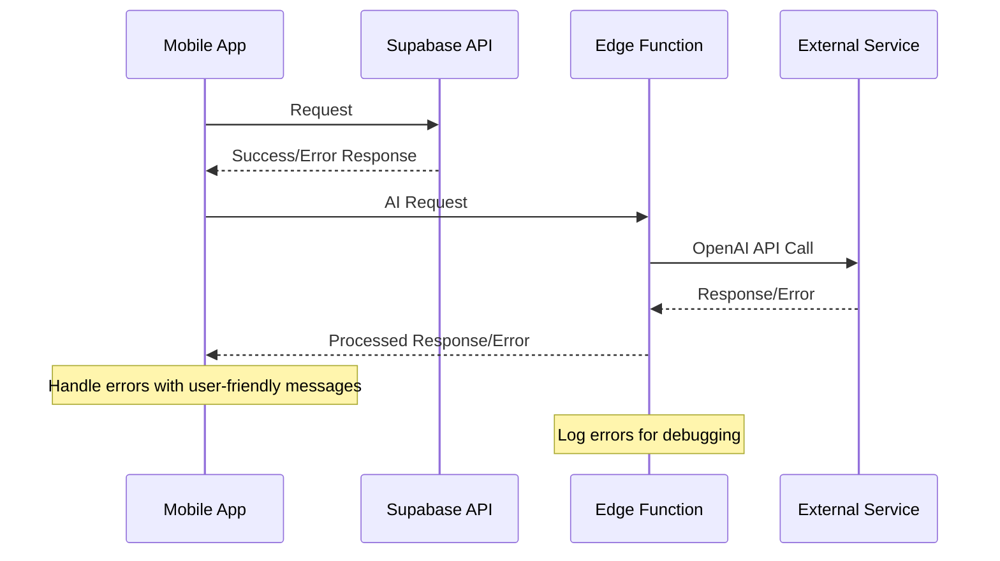

# Error Handling Strategy

## Error Flow



## Error Response Format

```typescript
interface ApiError {
  error: {
    code: string;
    message: string;
    details?: Record<string, any>;
    timestamp: string;
    requestId: string;
  };
}
```

## Frontend Error Handling

```typescript
// Global error handler for API calls
export const handleApiError = (error: any): string => {
  if (error?.response?.data?.error) {
    return error.response.data.error.message;
  }
  if (error?.message) {
    return error.message;
  }
  return 'An unexpected error occurred. Please try again.';
};

// Usage in components
const { data, error, isLoading } = useQuery({
  queryKey: ['journeys'],
  queryFn: journeyRepository.getAll,
  onError: (error) => {
    const message = handleApiError(error);
    showToast(message, 'error');
  }
});
```

## Backend Error Handling

```typescript
// Standard error handler for Edge Functions
export const handleEdgeFunctionError = (error: any, context: string) => {
  const errorId = crypto.randomUUID();
  
  console.error(`[${errorId}] ${context}:`, {
    error: error.message,
    stack: error.stack,
    timestamp: new Date().toISOString()
  });

  return new Response(
    JSON.stringify({
      error: {
        code: error.code || 'INTERNAL_ERROR',
        message: error.message || 'An unexpected error occurred',
        requestId: errorId,
        timestamp: new Date().toISOString()
      }
    }),
    {
      status: error.status || 500,
      headers: { 'Content-Type': 'application/json' }
    }
  );
};
```
