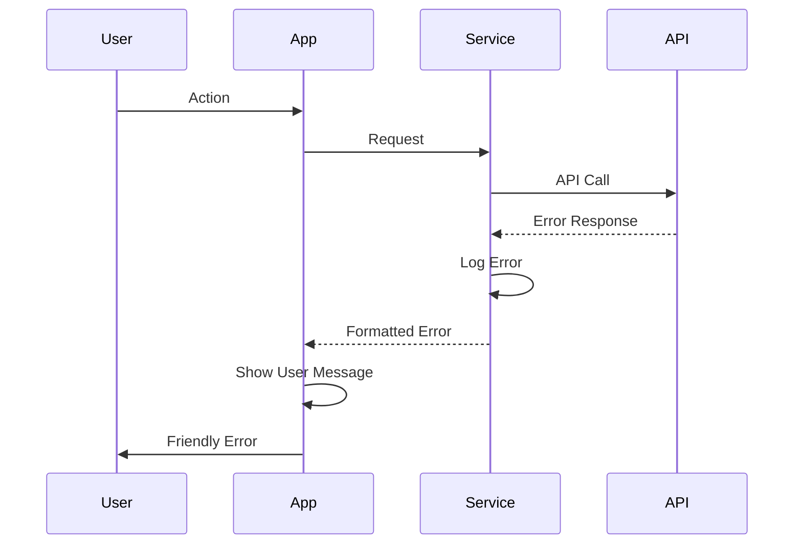

# Error Handling Strategy

## Error Flow



## Error Response Format

```typescript
interface ApiError {
  error: {
    code: string;
    message: string;
    details?: Record<string, any>;
    timestamp: string;
    requestId: string;
  };
}
```

## Frontend Error Handling

```typescript
// hooks/useErrorHandler.ts
export const useErrorHandler = () => {
  return (error: Error) => {
    if (error.message.includes('network')) {
      showToast('You appear to be offline. Changes will sync when connected.');
    } else if (error.message.includes('auth')) {
      navigateToLogin();
    } else {
      showToast('Something went wrong. Please try again.');
    }
    
    // Log to monitoring (post-MVP)
    console.error(error);
  };
};
```

## Backend Error Handling

```typescript
// functions/_shared/errorHandler.ts
export function handleError(error: unknown): Response {
  const errorResponse: ApiError = {
    error: {
      code: error.code || 'INTERNAL_ERROR',
      message: error.message || 'An unexpected error occurred',
      timestamp: new Date().toISOString(),
      requestId: crypto.randomUUID()
    }
  };
  
  return new Response(
    JSON.stringify(errorResponse),
    { 
      status: error.status || 500,
      headers: { 'Content-Type': 'application/json' }
    }
  );
}
```
