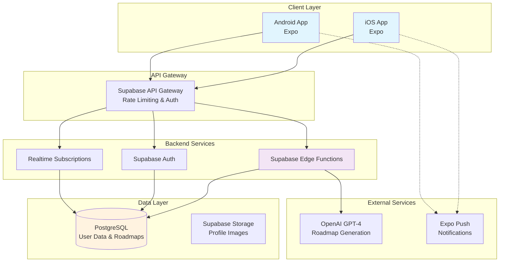

# High Level Architecture

## Technical Summary

The AI Habit Tracker employs a mobile-first serverless architecture using Expo React Native for the frontend and Supabase as the Backend-as-a-Service platform. The system integrates OpenAI's GPT-4 for intelligent roadmap generation through Supabase Edge Functions, with PostgreSQL providing persistent storage for user data and AI-generated progressions. Real-time synchronization enables offline-first habit tracking with eventual consistency, while the managed infrastructure approach accelerates MVP delivery within the 3-4 month timeline. This architecture directly supports the PRD's goal of transforming user aspirations into structured, AI-guided weekly progressions through a simple binary tracking interface.

## Platform and Infrastructure Choice

**Platform:** Supabase + Expo Application Services
**Key Services:** 
- Supabase Database (PostgreSQL)
- Supabase Auth (Authentication & Row Level Security)
- Supabase Edge Functions (AI integration & business logic)
- Supabase Realtime (Offline sync)
- Expo Push Notifications
- OpenAI API (GPT-4 for roadmap generation)

**Deployment Host and Regions:** 
- Mobile Apps: iOS App Store & Google Play Store via EAS
- Backend: Supabase US-East region (primary), with potential EU expansion post-MVP
- Edge Functions: Globally distributed via Supabase's infrastructure

## Repository Structure

**Structure:** Monorepo with organized package structure
**Monorepo Tool:** NPM Workspaces (built-in, no additional tooling complexity)
**Package Organization:** 
- `/app` - Expo React Native application
- `/supabase` - Edge Functions and database migrations
- `/shared` - Shared TypeScript types and utilities
- `/docs` - Architecture and product documentation

## High Level Architecture Diagram

## Architectural Patterns

- **Offline-First Mobile Architecture:** Local SQLite caching with background sync to Supabase - _Rationale:_ Users need reliable daily habit tracking even without connectivity
- **Serverless Functions Pattern:** Stateless Edge Functions for AI operations and complex logic - _Rationale:_ Scales automatically with user growth while minimizing operational overhead
- **Backend-as-a-Service (BaaS):** Supabase provides managed infrastructure - _Rationale:_ Accelerates MVP development timeline from 6+ months to 3-4 months
- **Repository Pattern:** Abstract data access through service layers - _Rationale:_ Enables testing and potential future migration flexibility
- **Component-Based UI:** Reusable React Native components with TypeScript - _Rationale:_ Maintainability and type safety across the mobile application
- **Event-Driven Updates:** Real-time subscriptions for multi-device sync - _Rationale:_ Users may switch between devices and expect consistent state
- **API Gateway Pattern:** Supabase API provides centralized entry point - _Rationale:_ Built-in auth, rate limiting, and monitoring without custom implementation
- **Domain-Driven Design:** Clear separation between user goals, roadmaps, habits, and progress - _Rationale:_ Aligns code structure with business domain for clarity
