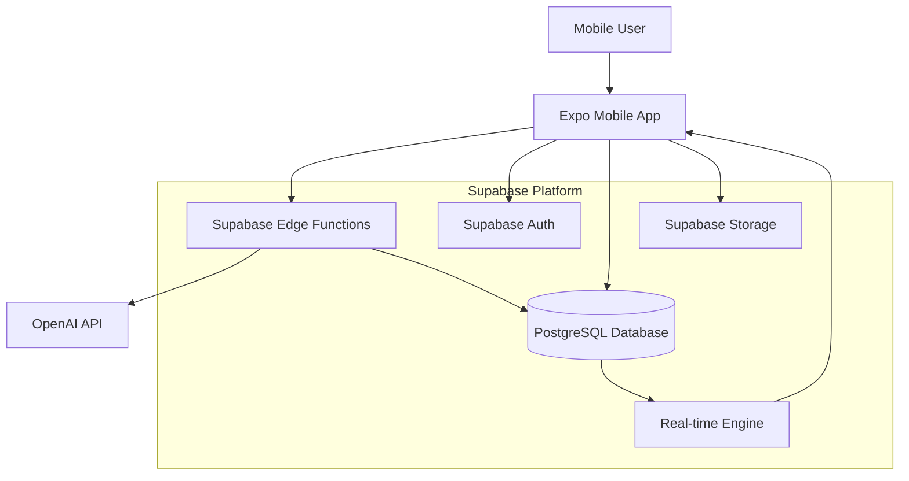

# High Level Architecture

## Technical Summary

AI Habit Tracker employs a mobile-first serverless architecture built on Expo (React Native) with Supabase backend services. The application leverages a RESTful API design with real-time database synchronization for seamless offline/online habit tracking. Key integration points include OpenAI API for AI-powered goal breakdown, Supabase Auth for user management, and PostgreSQL for structured data persistence. The infrastructure utilizes Supabase's global edge network for optimal performance, while the AI goal generation system runs on Supabase Edge Functions to minimize latency and ensure data privacy. This architecture achieves the PRD's goals of frictionless daily tracking, AI-guided progression, and adaptive habit journeys through a simplified tech stack that prioritizes developer velocity and user experience.

## Platform and Infrastructure Choice

**Analysis of Options:**

1. **Expo + Supabase** (Recommended)
   - **Pros:** Rapid mobile development, built-in auth/storage, real-time features, edge functions for AI processing, excellent developer experience
   - **Cons:** Vendor lock-in, less control over infrastructure
   
2. **React Native + AWS**
   - **Pros:** Enterprise scale, full control, extensive services
   - **Cons:** Complex setup, higher learning curve, more operational overhead
   
3. **Expo + Firebase**
   - **Pros:** Google ecosystem integration, mature platform
   - **Cons:** More expensive, less developer-friendly than Supabase for this use case

**Recommendation:** Expo + Supabase is optimal for this MVP given the requirements for rapid development, mobile-first design, and AI integration needs.

**Platform:** Supabase
**Key Services:** Auth, PostgreSQL, Edge Functions, Storage, Real-time subscriptions
**Deployment Host and Regions:** Supabase global edge network (US-East, Europe, Asia-Pacific)

## Repository Structure

**Structure:** Monorepo with shared packages
**Monorepo Tool:** npm workspaces (built into npm 7+)
**Package Organization:** Separation between mobile app, shared types/utilities, and potential future web dashboard

```
ai-habit-tracker/
├── apps/
│   └── mobile/          # Expo React Native app
├── packages/
│   ├── shared/          # Shared types and utilities
│   └── api-client/      # Supabase client configuration
└── supabase/            # Database migrations and edge functions
```

## High Level Architecture Diagram



## Architectural Patterns

- **Mobile-First Progressive Web Architecture:** Expo-based mobile app with potential web dashboard - _Rationale:_ Aligns with PRD's mobile-first approach while keeping web options open
- **Serverless-First Backend:** Supabase Edge Functions for AI processing and business logic - _Rationale:_ Reduces operational complexity and scales automatically with usage
- **Online-First Data Access:** Direct Supabase API calls with graceful error handling - _Rationale:_ Simplified architecture for MVP, most users have reliable connectivity for brief daily check-ins
- **Event-Driven Real-time Updates:** PostgreSQL triggers with real-time subscriptions - _Rationale:_ Enables responsive UI updates and future collaborative features
- **API Gateway Pattern:** Supabase Auto-API with Row Level Security - _Rationale:_ Reduces boilerplate while maintaining security through database-level policies
- **Repository Pattern:** Data access abstraction over Supabase client - _Rationale:_ Enables testing and potential future migration flexibility
