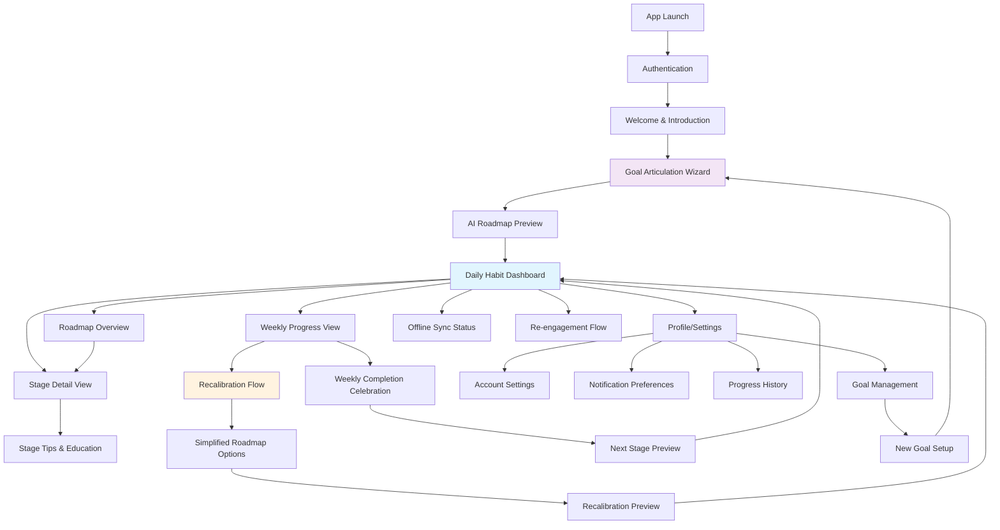
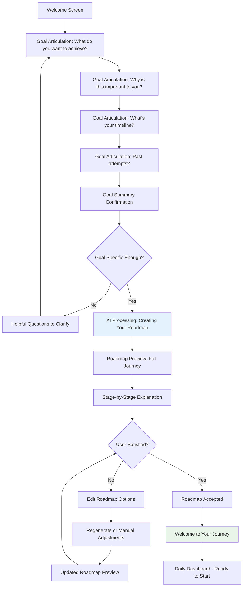
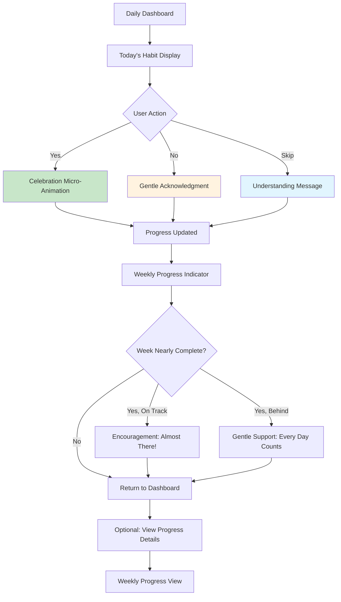
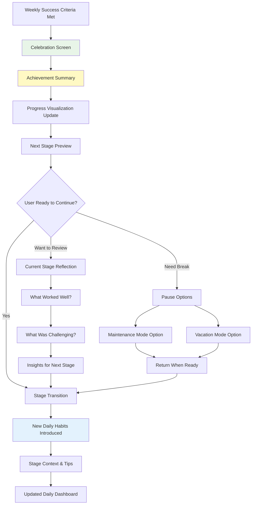

# AI Habit Tracker UI/UX Specification

## Introduction

This document defines the user experience goals, information architecture, user flows, and visual design specifications for **AI Habit Tracker's** user interface. It serves as the foundation for visual design and frontend development, ensuring a cohesive and user-centered experience that transforms the expertise gap in habit formation into an intuitive, shame-free journey of personal growth.

The AI Habit Tracker differentiates itself by providing AI-guided roadmaps rather than empty tracking interfaces, targeting goal-oriented beginners (ages 25-45) who have motivation but lack methodology for effective habit progression.

### Overall UX Goals & Principles

#### Target User Personas
- **Goal-Oriented Beginner**: Professionals/students (25-45) with meaningful aspirations who struggle to translate goals into daily actions. They have motivation but lack methodology, frequently abandon traditional habit apps within 2-3 weeks, and need structure without complexity.

#### Usability Goals
- **Immediate Clarity**: New users understand the AI-guidance value proposition within 30 seconds of opening the app
- **Frictionless Daily Interaction**: Core habit logging (Yes/No/Skip) completed in under 3 seconds with one thumb
- **Shame-Free Recovery**: Users who miss days or struggle with weekly stages feel supported rather than judged
- **Progressive Confidence**: Users gain confidence in their ability to reach long-term goals through weekly micro-achievements
- **Coaching Presence**: Interface feels like having a knowledgeable, patient personal coach rather than using a productivity tool

#### Design Principles
1. **Journey over Perfection** - Emphasize progress and adaptation rather than streaks or perfect completion
2. **Guidance over Tracking** - Provide clear next steps and reasoning rather than just data collection
3. **Warmth over Efficiency** - Prioritize emotional safety and encouragement over productivity metrics
4. **Simplicity through Intelligence** - Use AI to hide complexity while delivering personalized experiences
5. **Growth Metaphors** - Reinforce natural progression through visual language of seasons, paths, and organic development

### Change Log
| Date | Version | Description | Author |
|------|---------|-------------|---------|
| 2025-08-31 | 1.0 | Initial UI/UX specification creation | UX Expert |

## Information Architecture (IA)

### Site Map / Screen Inventory

### Navigation Structure

**Primary Navigation:** 
Tab-based bottom navigation with 4 core areas:
- **Today** (Daily Habit Dashboard) - Primary home screen
- **Progress** (Weekly Progress View) - Current week status
- **Journey** (Roadmap Overview) - Full progression timeline  
- **Profile** (Settings & History) - User management

**Secondary Navigation:**
- **Contextual actions** within each screen (edit roadmap, view tips, adjust notifications)
- **Progressive disclosure** for stage details and educational content
- **Floating action buttons** for primary actions (complete habit, access help)

**Breadcrumb Strategy:**
Minimal breadcrumbs due to mobile-first design. Instead, use:
- **Clear back arrows** with contextual labels ("Back to Today", "Back to Journey")
- **Progress indicators** in multi-step flows (wizard, recalibration)
- **Visual timeline position** in roadmap views showing current location

## User Flows

### Flow 1: First-Time Goal Setup & Roadmap Creation

**User Goal:** Transform a vague long-term aspiration into a structured, AI-generated weekly progression roadmap

**Entry Points:** 
- App first launch after account creation
- "Start New Goal" from Profile tab
- Re-engagement flow for returning users

**Success Criteria:** 
- User completes goal articulation with sufficient detail for AI processing
- AI generates 8-12 week roadmap that user accepts or customizes
- User feels confident and excited about their personalized journey

#### Flow Diagram

#### Edge Cases & Error Handling:
- **Vague goal input**: Conversational prompts help users clarify without making them feel inadequate
- **AI generation failure**: Graceful fallback with manual roadmap building assistance
- **User abandons mid-setup**: Save progress and gentle re-engagement via notifications
- **Unrealistic timeline**: AI suggests adjustments with explanation of why
- **User rejects multiple AI attempts**: Offer human-curated template roadmaps

### Flow 2: Daily Habit Logging

**User Goal:** Quickly and honestly log daily habit completion without friction or judgment

**Entry Points:**
- Daily Dashboard (primary)
- Push notification tap
- App icon badge tap
- Widget interaction

**Success Criteria:**
- Habit logged in under 3 seconds
- User feels supported regardless of Yes/No/Skip choice
- Progress visualization provides appropriate encouragement

#### Flow Diagram

#### Edge Cases & Error Handling:
- **Missed previous days**: Option to backfill with gentle messaging about progress not perfection
- **Multiple habit completion attempts**: Prevent duplicate logging while allowing corrections
- **Offline logging**: Queue actions for sync with clear offline indicators
- **Late-night logging**: Handle day boundaries intelligently (e.g., 2am logs for "yesterday")
- **Accidental taps**: Undo option with confirmation for changes

### Flow 3: Weekly Stage Completion & Progression

**User Goal:** Celebrate weekly achievement and smoothly transition to the next stage of their journey

**Entry Points:**
- Automatic trigger when weekly success criteria met
- Manual check from Weekly Progress View
- Push notification about stage completion

**Success Criteria:**
- User feels genuinely celebrated for their achievement
- Next stage preview builds excitement and confidence
- Transition maintains momentum without overwhelming user

#### Flow Diagram

#### Edge Cases & Error Handling:
- **User completed more than required**: Extra celebration and confidence boost
- **Borderline completion**: Offer choice to advance or repeat with positive framing
- **User has been inconsistent but met criteria**: Acknowledge growth over perfection
- **Next stage seems too challenging**: Option to modify difficulty or extend current stage
- **User wants to skip celebration**: Quick path to continue with optional return to celebration

## Wireframes & Mockups

### Design Files

**Primary Design Files:** Recommended to use **Figma** for collaborative design system development with the following organization:
- **AI Habit Tracker - Design System** (Components, colors, typography)
- **AI Habit Tracker - User Flows** (Detailed wireframes and prototypes)
- **AI Habit Tracker - Handoff** (Developer specifications and assets)

*Note: Figma links will be added once design files are created*

### Key Screen Layouts

#### Daily Habit Dashboard

**Purpose:** Primary home screen for effortless daily habit logging with encouraging progress context

**Key Elements:**
- Large, friendly greeting with user's name and current date
- Today's habit description in conversational language
- Prominent Yes/No/Skip buttons with tactile, accessible sizing (minimum 44pt touch targets)
- Current week progress visualization (dots or progress bar)
- Subtle stage context ("Week 2: Building Foundation")
- Quick access to stage tips and roadmap overview

**Interaction Notes:** 
- Single-tap logging with immediate haptic and visual feedback
- Micro-animations reinforce progress (growing plant, path progression)
- Offline indicator appears when not synced
- Pull-to-refresh for sync status

#### Goal Articulation Wizard

**Purpose:** Conversational onboarding flow that transforms vague aspirations into AI-processable goal definitions

**Key Elements:**
- Progress indicator showing current step (1 of 4, 2 of 4, etc.)
- Conversational question with friendly, encouraging tone
- Text input field with helpful placeholder examples
- "Why this matters" context for each question
- Back/Next navigation with smart validation
- Visual breathing space to reduce form anxiety

**Interaction Notes:**
- Questions reveal progressively (no overwhelming multi-step forms)
- Smart input validation with helpful, non-judgmental error messages
- Option to save and continue later at any step
- Adaptive follow-up questions based on previous answers

#### AI Roadmap Preview

**Purpose:** Showcase the personalized journey before user commits, building confidence and excitement

**Key Elements:**
- Timeline visualization showing all weekly stages
- Each stage displays: week number, theme, daily habit, brief rationale
- Clear visual distinction between foundation, building, and mastery phases
- Estimated completion date with flexibility messaging
- Edit/regenerate options prominently but non-threateningly placed
- "Why this progression works" educational content

**Interaction Notes:**
- Scrollable timeline with smooth parallax effects
- Expandable stage cards for detailed information
- Drag-to-reorder stages (where logically possible)
- Preview daily habits with context of how they build toward the goal

#### Weekly Progress View

**Purpose:** Provide encouraging feedback on current week performance with supportive messaging regardless of completion level

**Key Elements:**
- Calendar view of current week with visual completion states
- Encouraging headline based on current progress pattern
- Success criteria clearly stated (e.g., "Complete 5 out of 7 days to advance")
- Supportive messaging for different scenarios (ahead, on track, behind)
- Quick preview of next stage to maintain motivation
- Gentle access to recalibration options if struggling

**Interaction Notes:**
- Tap on individual days to see completion status and context
- Swipe to view previous weeks' patterns
- Celebratory animations when success criteria are met
- No shame-inducing language or visualizations for missed days

#### Recalibration Flow

**Purpose:** Supportive adjustment interface that frames difficulty as learning rather than failure

**Key Elements:**
- Warm, understanding opening message acknowledging the challenge
- Analysis of current completion patterns without judgment
- Multiple adaptation options: repeat stage, simplify habits, extend timeline
- Clear explanation of how recalibration helps rather than hinders progress
- Preview of adjusted roadmap before confirmation
- Option to return to original plan if circumstances change

**Interaction Notes:**
- No "failure" language anywhere in the interface
- Emphasis on learning and adaptation as strength
- Multiple choice options rather than requiring user to articulate problems
- Clear connection between adjustment and long-term goal achievement

## Component Library / Design System

### Design System Approach

**Design System Approach:** **Custom Design System** built specifically for AI Habit Tracker's unique positioning as a supportive, coaching-focused habit formation tool. While leveraging React Native/Expo UI patterns for familiarity, we'll create custom components that embody the growth-metaphor visual language and shame-free interaction philosophy.

**System Foundation:** Start with React Native Elements base components, then customize extensively for:
- Warm, natural color palette inspired by growth and seasons
- Rounded, organic shapes that feel approachable rather than corporate
- Micro-interactions that reinforce progress and encouragement
- Accessibility-first approach with WCAG AA compliance built-in

### Core Components

#### Habit Logging Button

**Purpose:** Primary interaction component for daily Yes/No/Skip logging with immediate emotional feedback

**Variants:** 
- **Yes Button**: Large, prominent, celebration-ready (soft green, growing animation)
- **No Button**: Equally sized, supportive messaging (warm amber, gentle acknowledgment)  
- **Skip Button**: Secondary styling, understanding tone (soft blue, gentle acceptance)

**States:** Default, Pressed, Selected (with confirmation), Disabled (past days), Loading (sync in progress)

**Usage Guidelines:** 
- Always appear as a set of three with equal visual weight
- Minimum 44pt touch targets with generous spacing
- Include subtle haptic feedback on press
- Never show as red/green success/failure - maintain emotional neutrality

#### Progress Visualization Card

**Purpose:** Display weekly progress in an encouraging, non-judgmental way that emphasizes journey over perfection

**Variants:**
- **Week Overview**: 7-day calendar view with completion indicators
- **Stage Progress**: Multi-week timeline showing overall journey position
- **Celebration Mode**: Special styling for completed weeks/stages

**States:** Current Week, Past Weeks, Future Weeks, Completed, In Progress, Behind Schedule (but supportive)

**Usage Guidelines:**
- Use organic, growing metaphors (seeds to plants, path progression)
- Avoid harsh completion percentages - use encouraging language
- Consistent visual language across all progress visualizations
- Colorblind-friendly indicators beyond just color

#### Coaching Message Component

**Purpose:** Display AI-generated encouragement, tips, and guidance with consistent supportive personality

**Variants:**
- **Daily Encouragement**: Brief, contextual motivation for today's habit
- **Educational Tip**: Longer-form guidance about current stage or habit formation
- **Celebration Message**: Special acknowledgment for achievements and milestones
- **Recalibration Support**: Understanding, non-judgmental adjustment guidance

**States:** Default, Expanded (for longer content), Dismissed, New/Unread

**Usage Guidelines:**
- Consistent warm, professional-but-friendly tone
- Always focus on user agency and strength
- Include micro-animations that reinforce the supportive message
- Never use language that implies user failure or inadequacy

#### Stage Timeline Component

**Purpose:** Visual representation of the user's AI-generated roadmap with clear progression and context

**Variants:**
- **Compact Timeline**: Overview showing all stages in roadmap view
- **Detailed Stage**: Expanded view with habits, rationale, and tips
- **Current Stage**: Highlighted styling showing where user is now

**States:** Completed, Current, Upcoming, Modified (user customization), Recalibrated

**Usage Guidelines:**
- Clear visual connection between stages showing logical progression
- Consistent iconography for different types of habits/stages
- Easy access to "why this stage" educational content
- Support for user customization without losing AI guidance context

#### Conversational Input Component

**Purpose:** Text input that feels like chatting with a supportive coach rather than filling out forms

**Variants:**
- **Goal Articulation**: Multi-line input with encouraging placeholders
- **Reflection Input**: For weekly reflection and recalibration conversations
- **Feedback Input**: For user comments on roadmap or stage difficulty

**States:** Default, Focused, Validation (helpful, not harsh), Success, Error (supportive)

**Usage Guidelines:**
- Rounded, chat-bubble styling rather than harsh rectangular forms
- Placeholder text that provides helpful examples, not intimidating requirements
- Character limits communicated positively ("A few sentences is perfect")
- Smart validation that helps rather than blocks user progress

## Branding & Style Guide

### Visual Identity

**Brand Guidelines:** Custom brand identity developed specifically for AI Habit Tracker's unique positioning as an AI-powered personal growth coach rather than a productivity tool. The visual identity embodies warmth, natural growth, and supportive guidance while maintaining credibility and professionalism.

**Core Brand Attributes:**
- **Nurturing Coach**: Warm, knowledgeable, patient guidance
- **Natural Growth**: Organic progression, seasonal change, living systems
- **Gentle Strength**: Supportive but not weak, encouraging but not patronizing  
- **Intelligent Simplicity**: Sophisticated AI hidden behind intuitive interfaces

### Color Palette

| Color Type | Hex Code | Usage |
|------------|----------|--------|
| Primary | #4A90A4 | Main brand color, key CTAs, progress indicators |
| Secondary | #7FB069 | Growth/success states, completed habits, positive reinforcement |
| Accent | #F4A259 | Warm highlights, encouragement messages, celebration moments |
| Success | #81B29A | Habit completion, stage advancement, achievement celebrations |
| Warning | #E9C46A | Gentle reminders, recalibration suggestions, helpful notices |
| Error | #F76C6C | Support (not failure), adjustment opportunities, gentle redirects |
| Neutral-100 | #F8F9FA | Background, cards, content areas |
| Neutral-300 | #CED4DA | Borders, dividers, secondary text |
| Neutral-600 | #6C757D | Primary text, labels, important information |
| Neutral-900 | #212529 | Headers, emphasis text, high contrast elements |

### Typography

#### Font Families
- **Primary:** Inter (Clean, readable, friendly but professional)
- **Secondary:** Poppins (Warmer, more personality for headings and encouragement)
- **Monospace:** SF Mono / Roboto Mono (Code, data, precise information)

#### Type Scale

| Element | Size | Weight | Line Height |
|---------|------|--------|-------------|
| H1 | 28px | 600 (Semi-Bold) | 1.25 |
| H2 | 24px | 600 (Semi-Bold) | 1.3 |
| H3 | 20px | 500 (Medium) | 1.35 |
| Body | 16px | 400 (Regular) | 1.5 |
| Small | 14px | 400 (Regular) | 1.4 |
| Caption | 12px | 500 (Medium) | 1.3 |
| Button | 16px | 600 (Semi-Bold) | 1.2 |
| Coaching Text | 18px | 400 (Regular) | 1.6 |

### Iconography

**Icon Library:** Phosphor Icons with custom growth-metaphor additions
- Consistent stroke width (1.5px) for cohesive visual rhythm
- Rounded line caps for friendly, approachable feel
- Custom icons for: habit stages, progress states, growth metaphors (seedling, path markers, milestones)

**Usage Guidelines:** 
- Icons always paired with labels for accessibility
- Growth metaphors (plants, paths, seasons) used consistently throughout
- Avoid overly abstract icons - prioritize immediate recognition
- Color should enhance, not replace, icon meaning

### Spacing & Layout

**Grid System:** 8px base grid system optimized for mobile-first design
- Component spacing: 8px, 16px, 24px, 32px multiples
- Screen margins: 16px minimum, 24px preferred
- Touch target minimum: 44px with 8px spacing between

**Spacing Scale:** 
- **XS**: 4px (fine adjustments, icon spacing)
- **SM**: 8px (component internal spacing)
- **MD**: 16px (component separation, card padding)
- **LG**: 24px (section separation, screen margins)
- **XL**: 32px (major section breaks)
- **XXL**: 48px (screen-level separation)

## Accessibility Requirements

### Compliance Target

**Standard:** WCAG 2.1 AA Compliance with selective AAA enhancements for critical user flows (daily habit logging, goal articulation, progress visualization)

**Priority Areas for Enhanced Accessibility:**
- Daily habit logging interface (core daily interaction)
- Goal articulation wizard (critical onboarding flow)
- Progress visualization (essential feedback mechanism)
- Recalibration flows (support for struggling users)

### Key Requirements

**Visual:**
- **Color contrast ratios**: 4.5:1 minimum for normal text, 3:1 for large text (18px+), with 7:1 for critical actions like habit logging buttons
- **Focus indicators**: 2px solid outline with high contrast color (#0066CC) visible on all interactive elements, never relying solely on color change
- **Text sizing**: Support dynamic type scaling from 75% to 200% without horizontal scrolling or content overlap, with coaching messages optimized for larger text

**Interaction:**
- **Keyboard navigation**: Full app navigation possible via external keyboard on mobile devices, with logical tab order through all interactive elements
- **Screen reader support**: VoiceOver/TalkBack compatibility with descriptive labels, hints, and state changes announced for all habit logging actions
- **Touch targets**: 44px minimum touch targets with 8px spacing, expanded to 64px for primary habit logging buttons

**Content:**
- **Alternative text**: Descriptive alt text for all progress visualizations, growth metaphor images, and stage progression graphics
- **Heading structure**: Proper H1-H6 hierarchy with meaningful section organization, especially in roadmap and progress views
- **Form labels**: Clear, descriptive labels for all inputs with error messages that explain how to fix issues supportively

### Testing Strategy

**Multi-Layer Accessibility Testing Approach:**

**Automated Testing:**
- Integrate accessibility linting (eslint-plugin-react-native-a11y) into development workflow
- Regular automated contrast ratio validation using Colour Contrast Analyser
- Screen reader simulation testing during component development

**Manual Testing:**
- Weekly VoiceOver/TalkBack navigation testing of critical flows
- Keyboard-only navigation testing for all user journeys
- Color vision deficiency simulation using tools like Stark or Color Oracle
- Dynamic type testing at 150% and 200% scaling

**User Testing:**
- Monthly accessibility user testing sessions with vision-impaired users
- Feedback collection on habit logging experience from users with motor impairments
- Regular consultation with disability advocacy groups for UX guidance

**Testing Schedule:**
- **Daily**: Automated linting and contrast validation
- **Sprint Review**: Manual screen reader and keyboard testing
- **Monthly**: User testing with accessibility-focused participants
- **Release**: Comprehensive accessibility audit before app store submission

## Responsiveness Strategy

### Breakpoints

| Breakpoint | Min Width | Max Width | Target Devices |
|------------|-----------|-----------|----------------|
| Mobile Small | 320px | 375px | iPhone SE, smaller Android phones |
| Mobile Large | 376px | 767px | iPhone Pro models, larger Android phones |
| Tablet | 768px | 1024px | iPad, Android tablets, phones in landscape orientation |

**Primary Focus:** Mobile receives 85% of design attention, with tablet optimization focused on landscape roadmap browsing and enhanced goal setup experiences.

### Adaptation Patterns

**Layout Changes:**
- **Mobile Small/Large**: Single-column layouts, full-width components, optimized for portrait orientation daily habit logging
- **Tablet**: Two-column layouts for roadmap view, side-by-side progress and stage details, enhanced goal articulation wizard

**Navigation Changes:**
- **Mobile**: Bottom tab bar navigation (Today, Progress, Journey, Profile) optimized for thumb reach
- **Tablet**: Enhanced bottom tabs with larger touch targets, floating action button patterns for primary actions

**Content Priority:**
- **Mobile**: Daily habit logging prioritized, current stage focus, simplified roadmap views
- **Tablet**: Extended roadmap becomes showcase feature, enhanced stage detail views, expanded coaching content

**Interaction Changes:**
- **Mobile**: Single-thumb optimization, minimal gestures, focus on speed of daily logging
- **Tablet**: Two-handed interaction patterns, enhanced gesture support for roadmap navigation, richer micro-interactions

## Animation & Micro-interactions

### Motion Principles

**Animation Philosophy:** **Subtle Growth Reinforcement** - All animations should feel like natural progression and organic development rather than flashy effects or productivity pressure. Motion serves the psychological needs of habit formation: building confidence, celebrating small wins, and maintaining momentum without creating anxiety or distraction.

**Core Motion Principles:**
1. **Organic Easing**: Use ease-out and spring animations that mimic natural growth patterns
2. **Purposeful Celebration**: Animations acknowledge user actions without overwhelming or patronizing
3. **Progress Visualization**: Motion helps users understand their journey progression intuitively
4. **Gentle Feedback**: All interactions provide immediate, calming confirmation
5. **Performance First**: Animations enhance experience without sacrificing app responsiveness

### Key Animations

**Habit Logging Confirmation:**
- **Description**: Gentle bounce and color transition when user taps Yes/No/Skip buttons with subtle haptic feedback
- **Duration**: 300ms
- **Easing**: Spring(tension: 300, friction: 8)

**Progress Visualization Growth:**
- **Description**: Smooth fill animations for weekly progress indicators, growing from left to right like plants developing
- **Duration**: 800ms
- **Easing**: Ease-out cubic-bezier(0.25, 0.46, 0.45, 0.94)

**Stage Completion Celebration:**
- **Description**: Gentle scale and glow animation with soft confetti particles, followed by smooth transition to next stage preview
- **Duration**: 1200ms total (celebration + transition)
- **Easing**: Ease-out with spring finale

**Roadmap Timeline Reveal:**
- **Description**: Stages appear sequentially with subtle slide-up motion, like path markers revealing along a journey
- **Duration**: 150ms per stage (staggered)
- **Easing**: Ease-out

**Recalibration Transition:**
- **Description**: Gentle morphing animation as roadmap adjusts, with supportive color transition from concern to hope
- **Duration**: 600ms
- **Easing**: Ease-in-out

**Goal Input Focus:**
- **Description**: Subtle text field expansion with warm color gradient, like giving the input space to breathe
- **Duration**: 250ms
- **Easing**: Ease-out

**Weekly Progress Sync:**
- **Description**: Gentle pulse animation during background sync with subtle loading state
- **Duration**: 2000ms loop
- **Easing**: Ease-in-out sine wave

**Navigation Tab Transitions:**
- **Description**: Smooth scale and color transitions with subtle icon morphing between states
- **Duration**: 200ms
- **Easing**: Ease-out

## Performance Considerations

### Performance Goals

- **Daily Habit Logging Response**: < 200ms from tap to visual confirmation (critical daily interaction)
- **App Launch Time**: < 2 seconds cold start, < 500ms warm start (supports quick daily access)
- **AI Roadmap Generation**: < 3 seconds total (as specified in PRD NFR1)
- **Screen Navigation**: < 150ms transition animations between core screens
- **Offline Sync Recovery**: < 1 second to restore and display cached habit data
- **Weekly Progress Loading**: < 800ms for full week visualization with animations
- **Memory Usage**: < 150MB peak usage during normal operation
- **Battery Impact**: < 2% battery drain per typical daily usage session

### Design Strategies

**Performance-First Design Decisions:**

**Optimized Asset Strategy:**
- **Vector Icons**: SVG icons cached and reused across components to minimize bundle size
- **Image Compression**: All growth metaphor imagery optimized for mobile screens (2x/3x resolution sets)
- **Font Subset**: Only required Inter and Poppins character sets included to reduce bundle size
- **Color-Based Graphics**: Progress visualizations use CSS/React Native styling rather than images where possible

**Component Performance Optimization:**
- **Lazy Loading**: Roadmap timeline components render progressively as user scrolls
- **Memoization**: Heavy components (progress charts, timeline views) use React.memo and useMemo extensively
- **Virtual Lists**: Future feature lists (past weeks, completed stages) implement FlatList virtualization
- **State Management**: Zustand for lightweight client state, React Query for optimized server state caching

**Animation Performance:**
- **Hardware Acceleration**: All animations use transform properties (translateX/Y, scale, opacity) for GPU acceleration
- **Animation Queuing**: Complex celebrations queue rather than run simultaneously to prevent frame drops
- **Reduced Motion**: Instant feedback alternatives maintain < 200ms response for accessibility users
- **Spring Physics**: React Native Reanimated 2 spring animations with optimized tension/friction values

**Network Optimization:**
- **Offline-First**: Daily habit logging works immediately with background sync
- **Request Batching**: Multiple habit completions sync as single API call when connectivity resumes
- **Aggressive Caching**: Weekly progress data cached locally with smart invalidation
- **AI Response Streaming**: Roadmap generation provides progressive feedback during 3-second creation

**Memory Management:**
- **Component Cleanup**: Animation listeners and timers properly disposed on unmount
- **Image Optimization**: Progress visualization images garbage collected after screen transitions
- **State Cleanup**: Old weekly progress data archived rather than maintained in active memory
- **Cache Limits**: Local storage capped at 50MB with LRU eviction for historical data

## Next Steps

### Immediate Actions

1. **Stakeholder Review & Approval**: Present complete UI/UX specification to product stakeholders for feedback on user flows, component architecture, and accessibility strategy

2. **Visual Design Creation**: Begin high-fidelity mockups in Figma implementing the established design system, color palette, and component library specifications

3. **User Flow Prototyping**: Create interactive prototypes for the three critical flows: Goal Setup Wizard, Daily Habit Logging, and Weekly Stage Progression

4. **Accessibility Audit Preparation**: Set up automated accessibility testing tools (eslint-plugin-react-native-a11y) and schedule initial user testing with accessibility-focused participants

5. **Design System Documentation**: Create comprehensive component documentation for developer handoff including interaction states, animation specifications, and accessibility requirements

6. **Performance Baseline Establishment**: Set up performance monitoring tools and establish baseline metrics for the defined performance goals (200ms logging response, 3s AI generation)

### Design Handoff Checklist

- [x] All user flows documented with decision points and edge cases
- [x] Component inventory complete with variants, states, and usage guidelines  
- [x] Accessibility requirements defined with WCAG 2.1 AA compliance strategy
- [x] Responsive strategy clear for mobile-first implementation with tablet enhancements
- [x] Brand guidelines incorporated with warm, growth-focused visual identity
- [x] Performance goals established with mobile-optimized animation and interaction specifications
- [ ] High-fidelity visual designs created in Figma
- [ ] Interactive prototypes built for critical user flows
- [ ] Design system documented for developer implementation
- [ ] Accessibility user testing scheduled and conducted
- [ ] Performance monitoring tools configured
- [ ] Design review completed with stakeholder approval

**Ready for handoff to Design Architect for technical implementation planning!**